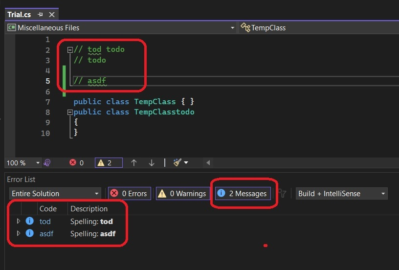
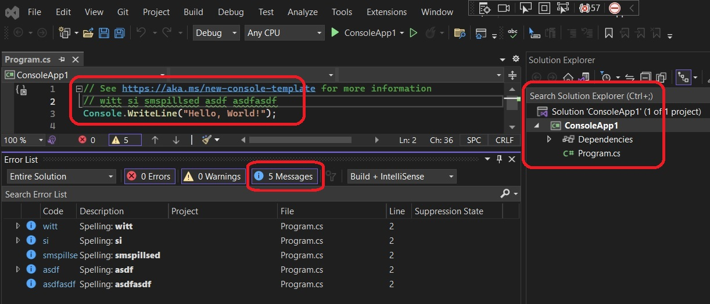

# ErrorList Sample

## Reference: 

1. https://github.com/microsoft/VSSDK-Extensibility-Samples/tree/master/ErrorList

## How this project is created. 

1. Create a VSix project.

2. Added necessary references, such as presentation core etc.


3. Add an asset node of type MefComponent in the vsixmanifest, etc


4. The above two steps can be accomplished by adding a EditorClassifier new item and then deleting it.
5. Next add the remaining files.


## How to run

1. Build and run. In the exp instance, open a code file with has a comment line, and that line has spelling mistakes. 



2. You can do the same with a cs project such as a console application.



## Notes

1. Open the SpellCheckerTagger.cs file and you will see the following method.

```cs
public IEnumerable<ITagSpan<IErrorTag>> GetTags(NormalizedSnapshotSpanCollection spans)
{
    if (_spellingErrors != null)
    {
        foreach (var error in _spellingErrors.Errors)
        {
            //if (spans.IntersectsWith(error.Span))
            //{
            yield return new TagSpan<IErrorTag>(error.Span, new ErrorTag(PredefinedErrorTypeNames.Warning));
            //}
        }
    }
}
```

Note that the if condition is commented. If I uncomment, then its throwing exception. Need to check why. With the commented out code, its working well. 

So why is there an if condition present in the first place, needs to be checked.

1.  


