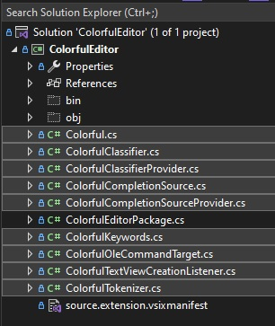

# Colorful Language Editor

## Reference: 
1. https://www.codeproject.com/Articles/1245021/Extending-Visual-Studio-to-Provide-a-Colorful-Lang

## How this project is created. 
1. Create a VSix project.
2. Added reference System.ComponentModel.Composition.
3. Added necessary references, such as presentation core etc.

4. References, and adds an asset node of type MefComponent in the vsixmanifest, etc

5. Then Add the files from the code download from the above reference.

6. Ensure namespaces are corrected according to the project you created. 
7. Build and Run and place a break point in the ctor of ColorfulTextViewCreationListener class.
