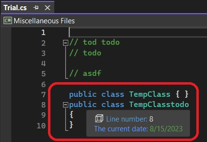

# Colorful Language Editor

## Reference: 
1. https://github.com/microsoft/VSSDK-Extensibility-Samples/tree/master/AsyncQuickInfo

## How this project is created. 
1. Create a VSix project.

2. Added reference System.ComponentModel.Composition.

3. Added necessary references, such as presentation core etc.

4. References, and adds an asset node of type MefComponent in the vsixmanifest, etc

5. The above two steps can be accomplished by adding a EditorClassifier new item and then deleting it.

6. Then Add the files from the code download from the above reference. LineAsyncQuickInfoSource.cs and LineAsyncQuickInfoSourceProvider.cs

7. Ensure namespaces are corrected according to the project you created. 

8. Build and Run..

9. In the exp intance of the visual studio, open a file with extension .cs. 

10. Note the [ContentType("any")] on the class **LineAsyncQuickInfoSourceProvider **

So try opening any kind of file. A tool tip must appear.

# Notes
1. 
