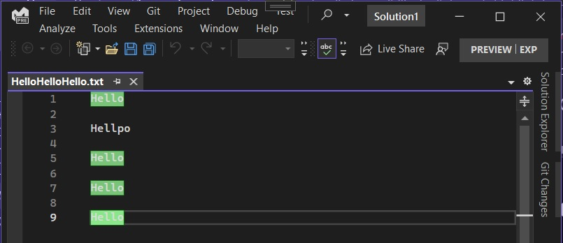
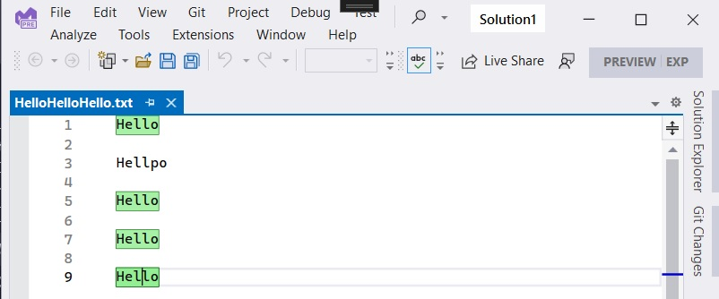
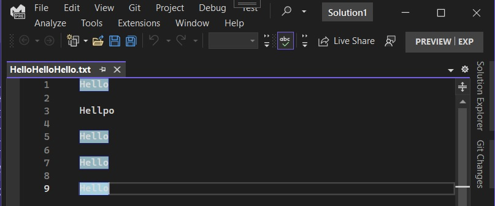
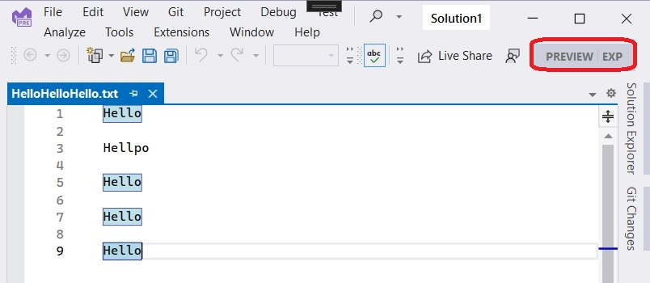
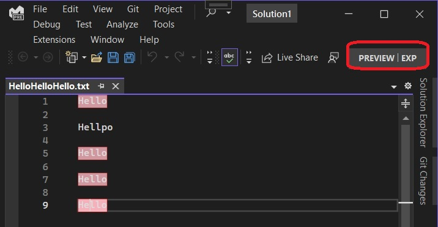
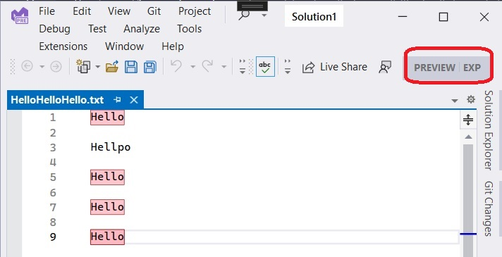

# Colorful Language Editor

## Reference: 
1. https://github.com/microsoft/VSSDK-Extensibility-Samples/tree/master/Highlight_Word
2. https://learn.microsoft.com/en-us/visualstudio/extensibility/walkthrough-highlighting-text

## How this project is created. 
1. Create a VSix project.

2. Added reference System.ComponentModel.Composition.

3. Added necessary references, such as presentation core etc.


4. References, and adds an asset node of type MefComponent in the vsixmanifest, etc


5. The above two steps can be accomplished by adding a EditorClassifier new item and then deleting it.

6. Then Add the files as per the reference, [Walkthrough: Highlight text](https://learn.microsoft.com/en-us/visualstudio/extensibility/walkthrough-highlighting-text)

7. Ensure namespaces are corrected according to the project you created. 

8. Build and Run..

9. In the exp intance of the visual studio, open a text file(.txt). Example open HelloHelloHello.txt file.

Ensure the ctor of HighlightWordFormatDefinition is as follows.
```cs
public HighlightWordFormatDefinition()
{
	this.BackgroundColor = Colors.LightGreen;
	this.ForegroundColor = Colors.DarkGreen;
	this.DisplayName = "Highlight Word";
	this.ZOrder = 5;
}	
```

Now run the example, 



Changed the theme(Tools -> Theme -> Light)



Ensure the ctor of HighlightWordFormatDefinition is as follows.

```cs
public HighlightWordFormatDefinition()
{
	this.BackgroundColor = Colors.LightBlue;
	this.ForegroundColor = Colors.DarkBlue;
	this.DisplayName = "Highlight Word";
	this.ZOrder = 5;
}
```




Changed the theme(Tools -> Theme -> Light)




Ensure the ctor of HighlightWordFormatDefinition is as follows.

```cs
public HighlightWordFormatDefinition()
{
	this.BackgroundColor = Colors.LightPink;
	this.ForegroundColor = Colors.DarkRed;
	this.DisplayName = "Highlight Word";
	this.ZOrder = 5;
}
```



Changed the theme(Tools -> Theme -> Light)




10. Note the [ContentType("text")] on the class **HighlightWordTaggerProvider**

## To do.
1. Need to learn more about ITextMarkerTag and [TextMarkerTag](https://learn.microsoft.com/en-us/dotnet/api/microsoft.visualstudio.text.tagging.textmarkertag)

2. Need to learn more about MarkerFormatDefinition and [EditorFormatDefinition](https://learn.microsoft.com/en-us/dotnet/api/microsoft.visualstudio.text.classification.markerformatdefinition#remarks)

3. Need to learn more about [IViewTaggerProvider](https://learn.microsoft.com/en-us/dotnet/api/microsoft.visualstudio.text.tagging.iviewtaggerprovider)

4. 

