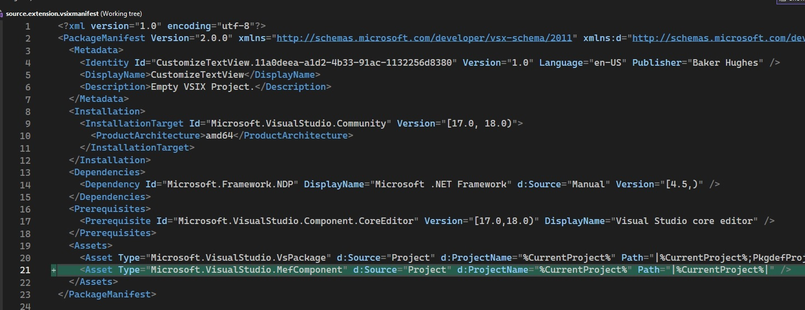

# Typing Speed Meter

## Reference: 
1. https://github.com/microsoft/VSSDK-Extensibility-Samples/tree/master/Typing_Speed_Meter

## How this project is created. 
1. Create a VSix project.

2. Added reference System.ComponentModel.Composition.

3. Added necessary references, such as presentation core etc.

4. References, and adds an asset node of type MefComponent in the vsixmanifest, etc

5. The above two steps can be accomplished by adding a EditorClassifier new item and then deleting it.

6. 
# Notes
1. I am not sure this is working. Need to check again. The highlighting seems to be working the same. 
