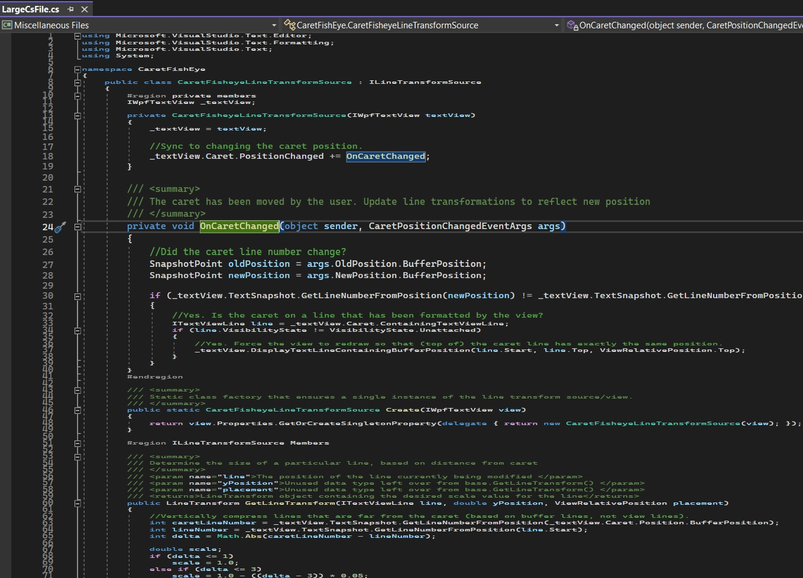

# Typing Speed Meter

## Reference: 
1. https://github.com/microsoft/VSSDK-Extensibility-Samples/tree/master/Caret_Fish_Eye

## How this project is created. 
1. Create a VSix project.

2. Added reference System.ComponentModel.Composition.

3. Added necessary references, such as presentation core etc.

4. References, and adds an asset node of type MefComponent in the vsixmanifest, etc

5. The above two steps can be accomplished by adding a EditorClassifier new item and then deleting it.

6. Now add the other files from the above reference. 

7. Build and Run.

8. Load any large cs file. 

9.  Once loaded, open any file in the Text Editor. 
 
11. Move the text caret around the screen

12. Compare the text size of the line that the caret is currently on to the size of surrounding lines

