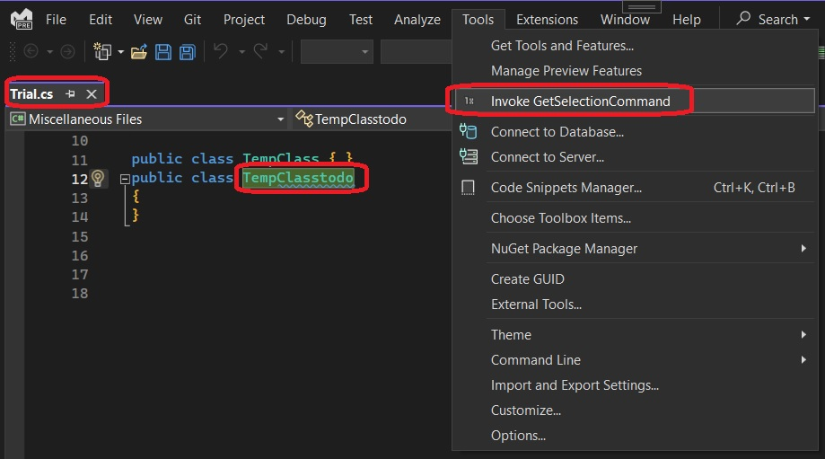
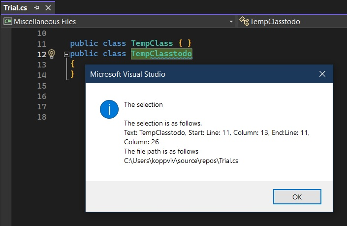

## Reference
1. https://michaelscodingspot.com/visual-studio-2017-extension-development-tutorial-part-3-add-context-menu-get-selected-code/

## How this project is built.
1. Started with a VSix project. 
2. Created a folder Called Commands and then added a command called GetSelectionCommand.
3. In the vsct file, changed the IDM_VS_MENU_TOOLS to IDM_VS_CTXT_CODEWIN. 
4. Added the structs
   1. TextViewPosition
   2. TextViewSelection
5. In the command, added the following methods
   1. private async Task<TextViewSelection?> GetSelectionAsync()
   2. private async Task<string> GetActiveDocumentFilePathAsync() 

## Run the example
1. Open any text file.

2. Select some text.
3. Invoke the command.

## Notes
1. The other way to selecting of text is using DTE. Search for InsertGuidMenuCmd example. There the selection is obtained by using DTE objects.
2. This example is based on SVsTextManager and IVsTextManager2 and textManager.GetActiveView2();
3. Should come after 402500-VsTextManagerIntro
4. 