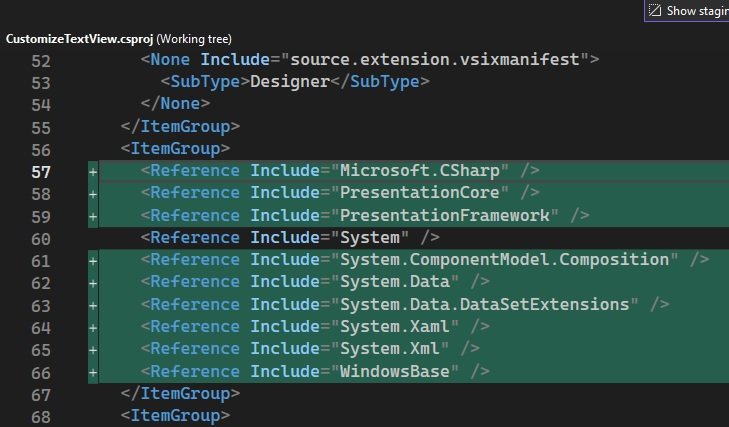

## Reference
1. https://michaelscodingspot.com/visual-studio-2017-extension-development-tutorial-highlight-code-in-editor/

## How this example is built.
1. Start from GetSelection Project.
2. Added reference System.ComponentModel.Composition.

3. Added necessary references, such as presentation core etc.

4. References, and adds an asset node of type MefComponent in the vsixmanifest, etc

5. The above two steps can be accomplished by adding a EditorClassifier new item and then deleting it.
6. Add the class BaseDialogWindow

7. 