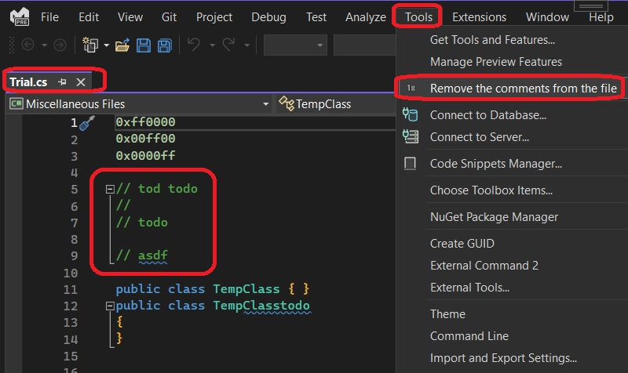

## Comment Remover

https://github.com/madskristensen/CommentRemover

https://github.com/microsoft/VSExtensibility/tree/main/New_Extensibility_Model/Samples/CommentRemover

## How to run.

1. Build and run the app.

2. Open any code file. For example, any csharp file such as Test.cs file. Let this file contain some comments.

3. Invoke the command. The comments should be removed.

