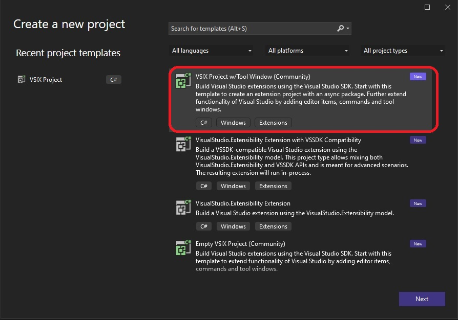
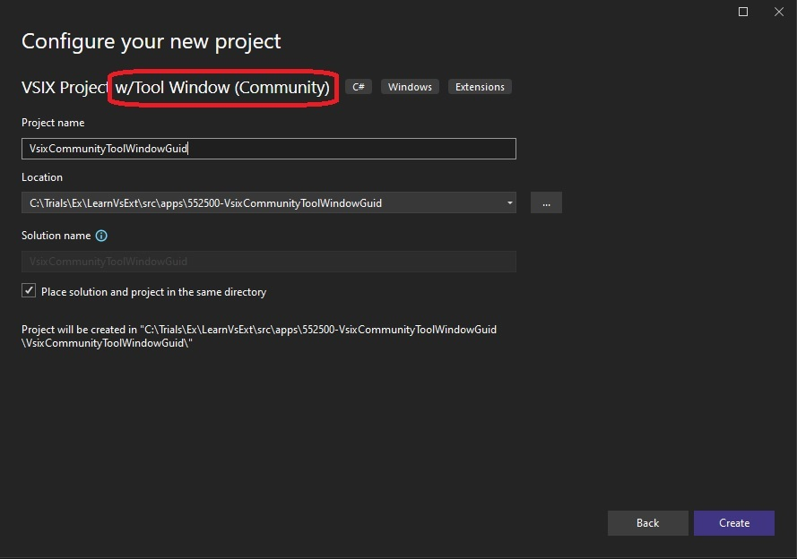
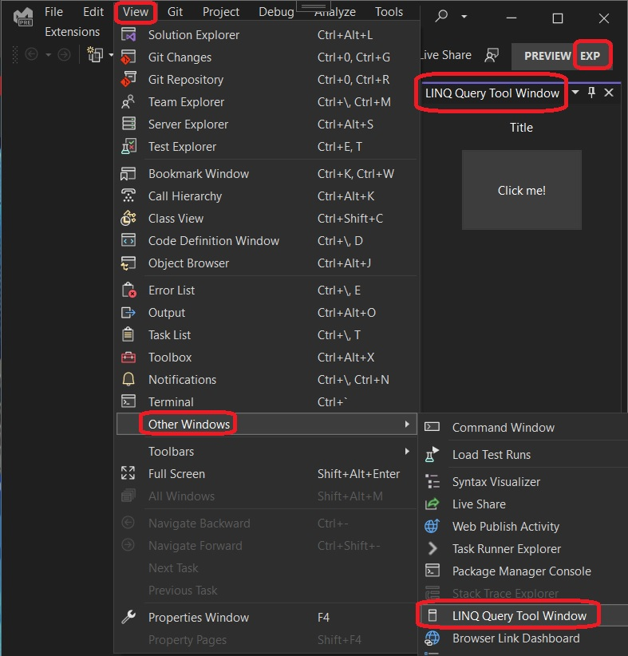

# Linq Language Editor Example

## References
1. https://github.com/SFC-Sarge/LinqLanguageEditor2022

2. https://www.vsixcookbook.com/recipes/Walkthrough-Create-Language-Editor.html

## How this project is built.

1. Create VSix Community Project with Tool Window as follows.
   

2. Configure the project.
   

3. Update the nuget packages to the latest. 

4. Changed MyCommand to LinqToolOptionsWindowCommandId in the file VSCommandTable.cs and VSCommandTable.vsct
```cs
internal sealed partial class PackageIds
{
   public const int LinqOptionsToolWindowCommandId = 0x0100;
}
```

```xml
<Buttons>
    <Button guid="LinqLanguageEditorPrepare" id="LinqToolWindowCommandId" priority="0x0100" type="Button">
      ...
    </Button>
</Buttons>
```

```xml
<Symbols>
   <GuidSymbol name="LinqLanguageEditorPrepare" value="{e77924cc-f23c-463f-aece-54f6a685bf63}">
      <IDSymbol name="LinqOptionsToolWindowCommandId" value="0x0100" />
   </GuidSymbol>
</Symbols>
```

5. Changed MyToolWindow to LinqToolWindow

6. Changed MyToolWindowCommand to LinqOptionsToolWindowCommand

7. Changed the tool window button from the following

```xml
<Strings>
   <ButtonText>My Tool Window</ButtonText>
   <LocCanonicalName>.View.MyToolWindow</LocCanonicalName>
</Strings>
```
to the following.
```xml
<Strings>
   <ButtonText>LINQ Query Tool Window</ButtonText>
   <LocCanonicalName>.View.LinqOptionsToolWindow</LocCanonicalName>
</Strings>
```

8. Changed the MyToolWindowControl UserControl to LinqToolWindowControl.

9. Added a Constants file to place constants. 

10. asdf

## Build and Run
1. Run and start the exp instance.



2. View -> Other Windows. Then click the button.


