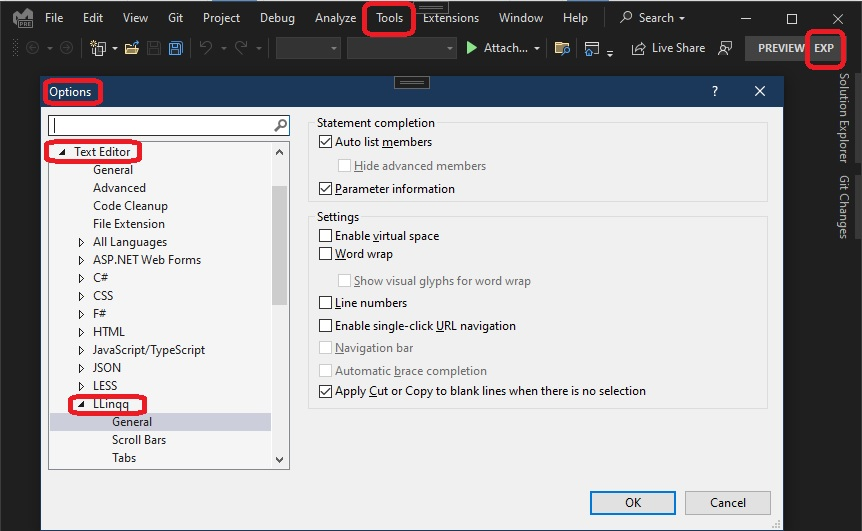

# Linq Language Editor Example introduces Language Service

## Objective
1. The earlier example 900900-LinqLanguageEditorPrepare prepares the project.

2. This example introduces Language Service.

3. The Community.VisualStudio.Toolkit offers a class called LanguageBase which derives from LanguageService. So this LanguageBase class is introduced in this example.


## References
1. https://github.com/SFC-Sarge/LinqLanguageEditor2022

2. https://www.vsixcookbook.com/recipes/Walkthrough-Create-Language-Editor.html

## How this project is built.
1. Starts from the earlier example 900900-LinqLanguageEditorPrepare

2. Then add the following attribute to the package class.

```cs
[ProvideLanguageService(typeof(LanguageBase), AppConstants.LinqLanguageName, 0, ShowHotURLs = false, DefaultToNonHotURLs = true, EnableLineNumbers = true, EnableAsyncCompletion = true, EnableCommenting = true, ShowCompletion = true, AutoOutlining = true, CodeSense = true)]
```

3. Also ensure to add the following cont to the AppConstants
```cs
public const string LinqLanguageName = "LLinqq";
```

4. Now build and Run. In the Exp instance, Tools -> Options you see the following. A new Text Editor option is added.



5.  


