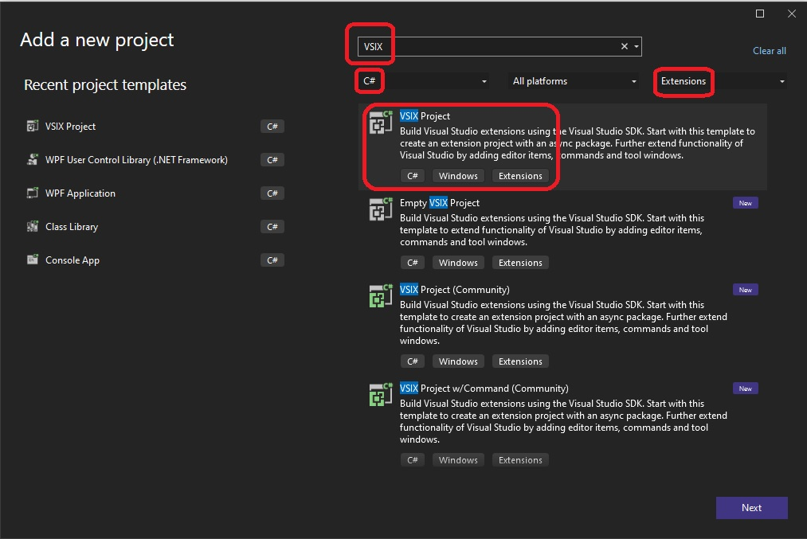

## New Project creation

1. Create a new project as follows.

2. Make it a Mef Component as follows. Solution Explorer -> Look for source.extension.vsixmanifest, right click -> Assets -> Edit.

3. Then add the files from the reference example.

## Build and Run.

1. Open any file with .txt extension. Press Ctrl + SpaceBar. 

2. Type ca, then press the down arrow or up arrow. So you can see the following.

## Notes
1. This example contains a lot of stuff, need to break up and undestand each interface
2. IAsyncCompletionItemManagerProvider
3. IAsyncCompletionItemManager
4. IAsyncCompletionCommitManager
5. IAsyncCompletionCommitManagerProvider
6. IAsyncCompletionSource
7. IAsyncCompletionSourceProvider

## References
1. https://github.com/microsoft/VSSDK-Extensibility-Samples/tree/master/AsyncCompletion
2. https://github.com/microsoft/vs-editor-api/tree/main/samples
3. https://github.com/microsoft/vs-editor-api/wiki/Modern-completion-walkthrough
4. https://github.com/microsoft/vs-editor-api/wiki/
5. https://github.com/KirillOsenkov/vs-editor-api/

