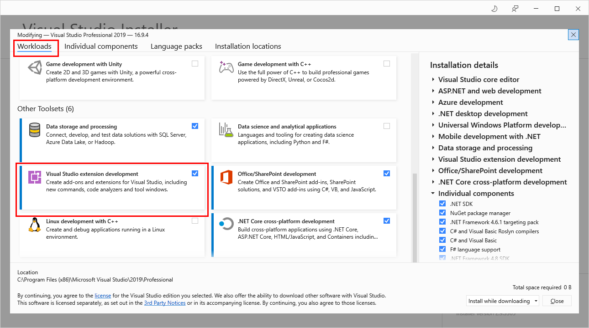
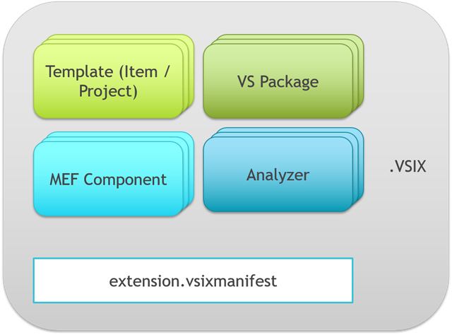
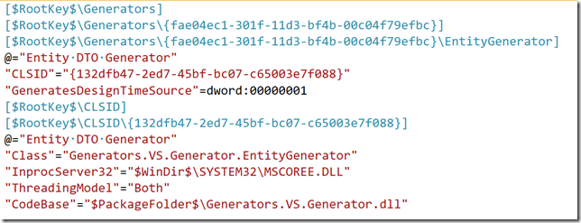

# JSON on steroids #1. About VS Extensions

https://mihailromanov.wordpress.com/2021/07/04/json-on-steroids-1-about-vs-extensions/

The beginning and list of all articles in the series can be found [here](https://mihailromanov.wordpress.com/2021/04/17/json-on-steroids/).


And we'll start our series with an overview of the basics of extension development in Visual Studio.

If you already have experience in such development, then you can safely skip this part and go straight to the next one, well, just look at the last point about JSON support

Today I plan to consider:

What do I need to create extensions for VS (I'll focus on the 2019 version)?
What is a .vsix package and what is it for?
What is MEF, and what is the difference between developing with MEF Components from VS Packages?
What does VS provide in terms of JSON support?
Well, let's begin...

Setting up the environment
The first thing we should start with is installing the VS SDK.

At the time of VS 2010-2013, it was a separate distribution. Now everything is installed through VS Installer: the Workloads\Visual Studio extension development component we need



In theory, you can do without installing the SDK. Everything that is required for the build is included through NuGet packages

* [Microsoft.VisualStudio.SDK](https://www.nuget.org/packages/Microsoft.VisualStudio.SDK) 
* [Microsoft.VSSDK.BuildTools](https://www.nuget.org/packages/Microsoft.VSSDK.BuildTools)

But (!) all the settings of the project itself, the edits of the manifest (which still need to be created!) will have to be done manually, and even almost blindly, since this option is not described anywhere.

On the other hand, the fact that everything you need to build is now moved to NuGet packages makes it much easier to set up CI/CD, and for development, the SDK itself is not difficult to install.

The following item is optional but highly recommended. This is a set of extensions for developers VS Extensions by Mads Kristensen depending on the version of VS, set:

* [Extensibility Essentials 2019](https://marketplace.visualstudio.com/items?itemName=MadsKristensen.ExtensibilityEssentials2019)
* or [Extensibility Essentials 2017](https://marketplace.visualstudio.com/items?itemName=MadsKristensen.ExtensibilityEssentials)

Now, before we go any further, we need to understand a few basic concepts: the VSIX package, the VSPackage, and the MEF Component.

VSIX package
A VSIX package is a unified way to distribute virtually any type of extension for Visual Studio.



Technically, a .vsix package is an Open Package Convention file, i.e. (to put it simply) it is a zip archive containing some special metadata files (such as [Content_Types].xml), as well as the "useful" data itself.

Inside a .vsix package, you can pass (I'll list the main ones):

- Project templates and item templates
- Extensions made as (more on them later):
  - VSPackage
  - MEF Components
- Parsers

All basic information about the .vsix package is stored in the extension.vsixmanifest file.

It's XML, with something like this:

```xml
<PackageManifest Version="2.0.0" xmlns="http://schemas.microsoft.com/developer/vsx-schema/2011">
  <Metadata>
    <Identity Id="TeamsManifestExtension.459c5d24-2256-49a4-a052-0aafccaca9d3" Version="1.0" Language="en-US" Publisher="Михаил Романов" />
    <DisplayName>TeamsManifestExtension</DisplayName>
    <Description xml:space="preserve">Empty VSIX Project.</Description>
  </Metadata>
  <Installation>
    <InstallationTarget Id="Microsoft.VisualStudio.Community"
               Version="[16.0, 17.0)" />
  </Installation>
  <Dependencies>
    <Dependency Id="Microsoft.Framework.NDP"
               DisplayName="Microsoft .NET Framework"
               Version="[4.5,)" />
  </Dependencies>
  <Prerequisites>
    <Prerequisite Id="Microsoft.VisualStudio.Component.CoreEditor"
                  Version="[16.0,17.0)"
                  DisplayName="Visual Studio core editor" />
  </Prerequisites>
  <Assets>
    <Asset Type="Microsoft.VisualStudio.MefComponent"
                 Path="TeamsManifestExtension.dll" />
  </Assets>
</PackageManifest>
```

# What you can find here:

- Title, description, version ... and other general information about the package (<Metadata>)
- Information about the specific extensions included in the package (<Assets>)
- Dependencies (e.g., the extension is designed for the C++ editor, so dependencies must specify that VS components are required to support C/C++) – (<Prerequisites> and <Dependencies>)
- VS versions and editions for which the package can be installed (<Installation>)

It doesn't look very transparent (the question of where to get dependency IDs may seem especially difficult), but fortunately, Microsoft took care of including a full-fledged GUI for editing manifests in the Visual Studio package.

For more information about the structure and features of VSIX, see [Shipping Visual Studio Extensions](https://docs.microsoft.com/en-us/visualstudio/extensibility/shipping-visual-studio-extensions)

# VSPackage

Historically, VSPackage is the earliest Visual Studio extension mechanism currently available (historically, the earlier is the Add-ins mechanism, which was officially deprecated in VS 2013, but in reality was almost abandoned much earlier.

In a nutshell, VSPackage is the entry point for your extension. When VS needs your extension code, it first accesses your VSPackage (for example, by calling the Initialize() method), and then can call the GetService() method when it needs a service that implements your extension.

The main feature of VSPackage-based extensions is how they are registered in the system.

VSPackage and registry
Originally, VS stores its settings in the registry

In versions prior to VS 2017, these were keys

- HKLM\Software\Microsoft\VisualStudio{Version}
- HKCU\Software\Microsoft\VisualStudio{Version}
- HKCU\Software\Microsoft\VisualStudio{Version}_Config

At the same time, a mechanism for creating isolated instances of VS settings was supported, for example, for debugging extensions. This was done by creating settings branches with a special suffix (most often Exp):

- HKCU\Software\Microsoft\VisualStudio{Version}{Suffix}
- HKCU\Software\Microsoft\VisualStudio{Version}{Suffix}_Config

However, starting with VS 2017, the mechanism of the so-called registry hives for the application is used. In this mechanism, the part of the registry needed by the program is stored in a separate file (for VS, it will be something like C:\Users\<user>\AppData\Local\Microsoft\VisualStudio\16.0_0e3d56fd\privateregistry.bin), which is mounted on the registry, but in such a way that its contents are available only to the application itself.

Due to the fact that the settings do not have a hard-coded "registration", a special mechanism for registering extensions based on VSPackage was developed, which uses special .pkgdef files

Here is an example of such a file (image from the editor in Visual Studio):



As you can see, it looks very much like a regular .regedt file, with minor adjustments.

It is clear that it is not very convenient to write such files manually, so for simplification, the following chain was proposed:

- The developer in the code puts special markup in the form of registration attributes

```CSharp
[Guid("132DFB47-2ED7-45BF-BC07-C65003E7F088")]
[ProvideCodeGenerator(
    typeof(EntityGenerator),
    "EntityGenerator",
    "Entity DTO Generator",
    true)]
public class EntityGenerator : BaseCodeGenerator
{

}
```

- For the finished assembly, a special utility [CreatePkgDef](https://learn.microsoft.com/en-us/visualstudio/extensibility/internals/createpkgdef-utility) is launched, which analyzes the assembly and generates a .pkgdef file (if you use a standard template for extensions, then this is done automatically - you don't need to run anything manually)

- The .pkgdef file is added to the VSIX package, along with the

The path is not the most trivial, but we are pleased with one thing here - modern editor extensions in VS, in the vast majority of cases, do not require working with VSPackage

# MEF Components

MEF or [Managed Extensibility Framework](https://docs.microsoft.com/en-us/dotnet/framework/mef/) is a library billed as a lightweight tool for creating applications with extensions. And, probably, it is logical that its first users were the Visual Studio team, which began to use MEF as the basis for creating extensions for the new version of the text editor engine, which appeared in VS 2010 (at the same time as most of the UI was transferred to WPF).

To put it very briefly, MEF offers the following concept:

- We have an application for which we create multiple extensibility points. The extensions themselves can be written either by you or by third-party developers (for example, you write an editor, and the extension is a spell checker for different languages)
  
- To describe such a plugin, we use a common interface, like this:

```cs
public interface ISpellchecker
{
    IEnumerable<Error> Check(string text);
}
```

- The Russian orthography developer writes an implementation of this interface, and in order for MEF to be able to find this implementation, he marks it with a special attribute:

```CSharp
[Export(typeof(ISpellchecker))]
class RuSpellchecker : ISpellchecker
{
    public IEnumerable<Error> Check(string text) 
    { 
     /// Реализация
    }
}
```

- Now in the application itself, we create and configure a container that will search for all implementations in the plugins folder

```CSharp
var catalog = new AggregateCatalog();
catalog.Catalogs.Add(new DirectoryCatalog("plugins"));
 
Container = new CompositionContainer(catalog);
```

- And when we need the plugins themselves, we'll find them like this:

```cs
var sps = Container.GetExportedValues<ISpellchecker>();
 
foreach (var sp in sps)
{
      sp.Check("....");
}
```

It is clear that this is the most primitive of all possible scenarios.

In a more interesting version, the application itself can implement a number of common services that can be useful to plugin developers. For example, a service for checking whether a word is included in the list of stop words (we exclude these words from the general check)

```CSharp
public interface IStopWordsService
{
     bool IsStopWord(string word);
}
```

For third-party developers to be able to use such a service, we just need to export its implementation:

```cs
[Export(typeof(IStopWordsService))]
class StopWordsService : IStopWordsService
{
    public bool IsStopWord(string word)
    {
        return false;
    }
}
```

And developers of spelchecker plugins will be able to use this service by simply importing:

```CSharp
[Export(typeof(ISpellchecker))]
class RuSpellchecker : ISpellchecker
{
    [Import]
    IStopWordsService StopWordsService { get; set; }
 
    public IEnumerable<Error> Check(string text)
    {
        StopWordsService.IsStopWord(text);
        return Enumerable.Empty<Error>();
    }
}
```

Of course, the examples above (especially the code itself) are somewhat artificial, but they do illustrate the basic tasks that MEF solves and how it does it.

Thus, the development of MEF-based extensions looks something like this:

- Creating an implementation of the desired interface
- mark it with the [Export] attribute
- if inside our extension we need to access some VS infrastructure, which is represented through MEF, then just import the necessary interfaces
- the created component is installed via a regular VSIX package (only it is obvious that it is MEF)

For me personally, it's much easier than creating VSPackage, but... Despite the fact that MEF has been used in Visual Studio for more than 10 years, it has almost never replaced VSPackages. That is, at the moment, you can use MEF:


- [writing extensions for text editors](https://docs.microsoft.com/en-us/visualstudio/extensibility/editor-and-language-service-extensions). Here, fortunately, almost all types of extensions are built on MEF (yes, a number of editors have remained on Legacy mechanisms, but there are only a few of them, and it is unlikely that you will need to modify them)

- [Creating your own project types based on the Common Project System](https://github.com/microsoft/vsprojectsystem). It should be noted here that a more classic option for creating your own project type (as a rule, it is required if we are talking about a new language or environment – but not only) is to use the [Managed Package Framework](https://docs.microsoft.com/en-us/visualstudio/extensibility/internals/using-the-managed-package-framework-to-implement-a-project-type-csharp) – this method has been recommended almost since VS 2008. Its main problem is excessive complexity in mastering and in supporting a product based on it. That is, in most cases, for a new type of project, you do not need even 10 of what is in MPF, but you have to use everything. Therefore, CPS developers have tried to simplify the implementation of at least typical scenarios. However:

  - CPS does not provide access to all the functionality of the VS project subsystem
  - there are serious difficulties with documentation (with MPFProj everything is also not perfect, but there are quite a lot of third-party articles, tutorials, ...)
  - This mechanism has not received much demand from third-party developers, it seems

- separate extensions for some non-built-in mechanisms. For example, [ASP.Net Scaffolding for VS is based on MEF](https://mihailromanov.wordpress.com/2021/02/23/asp-net-scaffolding-extending-4-visual-studio-scaffolder/).

And, perhaps, that's all. Even if you want to do something seemingly trivial – like adding an item to the menu – you'll have to create VSPackage...

But there is also good news. We will need almost 100% only MEFs for our extensions.

# JSON (and other Web languages) support in VS

It remains to figure out the last common point – what and where is implemented in VS in terms of JSON support (and for one reason – other markup languages for the Web).

For the first time, support for 3 languages for the Web at once: HTML, CSS, JSON appeared at least in Visual Studio 2013, and immediately with the ability to expand this support by third-party developers (which, on the one hand, was extremely unusual, and on the other hand, went almost unnoticed among potential users).

At the time of VS 2017, the language support mechanism could be found at <Directory_VS>\Common7\IDE\Extensions\Microsoft\Web Tools\Editors and the libraries were named as:

- Microsoft.CSS.Core.dll
- Microsoft.CSS.Editor.dll
- Microsoft.CSS.Editor.dll
- Microsoft.Html.Core.dll
- Microsoft.Html.Editor.dll
- Microsoft.JSON.Core.dll
- Microsoft.JSON.Editor.dll

However (I don't know exactly why) when VS [2019 Preview 2 was released, it was decided to make a number of breaking changes.](https://devblogs.microsoft.com/aspnet/changes-to-the-web-and-json-editor-apis-in-visual-studio-2019/). In particular, all libraries have moved to the adjacent Languages folder (<Directory_VS>\Common7\IDE\Extensions\Microsoft\Web Tools\Languages), library names have changed (see the article at the link), and the internal API has been partially changed.

However, these changes turned out to be more cosmetic - although they require code changes and recompilation.

What do these libraries contain? Let's look at the JSON example:

- Microsoft.WebTools.Languages.Json.dll

It contains a parser, support for working with JSON schemes, validators, ... – in general, basic language support functions that are not tied to the IDE in any way.

- Microsoft.WebTools.Languages.Json.Editor.dll

Here, on the contrary, there are classes related to the functioning of the JSON editor in VS: syntax highlighting, code hints, folding, ...

The most important thing for us is that this is where the interfaces that can be extended by a third-party developer are located.

- Microsoft.WebTools.Languages.Json.VS.dll

And this library contains VSPackage, as well as all sorts of internal classes for implementing language support. And there is also support for NPM and Bower.

For other languages, the distribution by libraries will be approximately similar.

In addition, often common (for all languages at once) classes are collected in libraries:

- Microsoft.WebTools.Languages.Shared.dll
- Microsoft.WebTools.Languages.Shared.Editor.dll
- Microsoft.WebTools.Languages.Shared.VS.dll

In the future, the following 4 will be enough for us:

- Microsoft.WebTools.Languages.Json.dll
- Microsoft.WebTools.Languages.Json.Editor.dll
- Microsoft.WebTools.Languages.Shared.dll
- Microsoft.WebTools.Languages.Shared.Editor.dll

You can either copy them to the Solution directory or connect them directly from the VisualStudio folder. Personally, I prefer the first option - this way there are fewer dependencies on setting up the environment on the machine.

Actually, now that we've briefly skimmed through the development of extensions in general, we can actually start with extensions for JSON.

