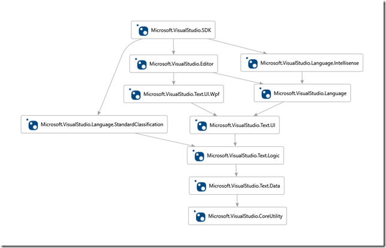
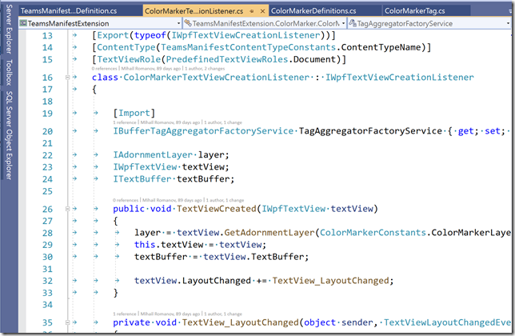
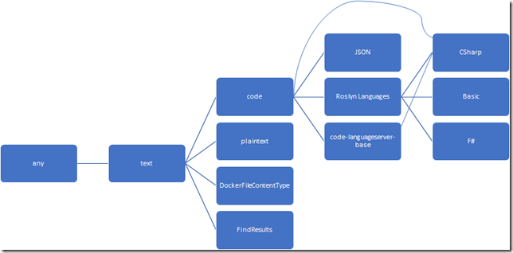

# JSON on steroids #2.1. Visual Studio Editor: Content Types

## 

Before we get into the promised extensions to the JSON editor, I want to skim through the part of the VS SDK that has to do with text editor support.

And in this article, we will discuss:

- which VS SDK packages have types associated with text editors and their extensions.
- how to work with ContentType Definitions – the task of this mechanism is to "enable"/"disable" editor extensions, only for those languages for which these extensions are designed (for example, one extension can work with arbitrary JSON, and another – as in our case – "understands" only a certain language, albeit on the basis of JSON)

## What to look for and where

If we take the general Microsoft.VisualStudio.SDK meta-package as a starting point and leave only packages related to the support of text editors and languages (as well as remove unnecessary transitive links), we will get something like this.



Perhaps, for the sake of completeness, the packages related to Language Server Protocol (LSP) support should also be added here, but they are not directly related to editors, so we will omit them.

And then I'll briefly describe what each of the packages is responsible for ()

<table>
  <tbody>
    <tr>
      <th align="left">Sl. No.</th>
      <th align="left">Package</th>
      <th align="left">Description</th>
    </tr>
    <tr>
      <td align="left">1</td>
      <td align="left">Microsoft.VisualStudio.CoreUtility</td>
      <td align="left">The main content of this package is types to support the Content Types mechanism (we'll talk about this later).
In addition, you can find the FeatureSetvice mechanism (I've seen references to it in the code, but I haven't found a good description of what it is or how to use it) and a number of other small helper classes.</td>
    </tr>
    <tr>
      <td align="left">2</td>
      <td align="left">Microsoft.VisualStudio.Text.Data	</td>
      <td align="left">This package contains basic types of text manipulation (insert, delete, replace, ...) such as ITextBuffer/ITextSnapshot and related or derived from them.</td>
    </tr>
    <tr>
      <td align="left">3</td>
      <td align="left">Microsoft.VisualStudio.Text.Logic</td>
      <td align="left">
      <p>Unlike the previous package, where the text is considered as nothing more than a set of characters, this one has mechanisms for basic "understanding" of the content</p>
    <ul>
          <li>classification mechanism – which allows you to bind each substring to a class (string literal, number, identifier, ...)</li>
          <li>Tagging mechanism – similar to classification, but more general: it allows you to match with each substring not just a type, but an arbitrary data object (for example, the text of a tooltip that should be shown when you hover the mouse cursor over a text element)</li>
          <li>Search and Replacement Mechanisms</li>
          <li>Undo/Redo mechanism</li>
           <li>search by template</li>                
        </ul>
        <p>
        Finally, there is a mechanism for declaring editor options (for example, the size of the tab, as well as whether to replace tab with spaces)
        </p>
      </td>
    </tr>
    <tr>
      <td align="left">4</td>
      <td align="left">Microsoft.VisualStudio.Language. StandardClassification</td>
      <td align="left">This package contains only a set of constants – the names of standard classifiers, as well as a service for obtaining IClassificationType objects from these names</td>
    </tr>
        <tr>
          <td align="left">5</td>
          <td align="left">Microsoft.VisualStudio.Text.UI <br> and <br> Microsoft.VisualStudio.Text.UI.Wpf</td>
          <td align="left">These 2 packages contain types responsible for text presentation, starting with the basic ITextView / IWpfTextView.
Here you can find classes for controlling formatting, rendering of different classes of text (the very "syntax highlighting"), collapsing/expanding blocks, all kinds of "adornments", etc</td>
    </tr>   
    <tr>
      <td align="left">6</td>
      <td align="left">Microsoft.VisualStudio.Editor</td>
      <td align="left">Here are the general types for controlling the editor as such. For example, mechanisms for managing window commands (from WPF)</td>
    </tr>
    <tr>
      <td align="left">7</td>
      <td align="left">Microsoft.VisualStudio.Language<br> and <br> Microsoft.VisualStudio.Language. Intellisense </td>
      <td align="left">These 2 packages contain types for implementing the language-specific Intellisense mechanisms, as well as the associated Code CleanUp and Code Lens
. Moreover, the first one is newer and contains Async versions of types for Intellisense, and the second one is synchronous.</td>
    </tr>
  </tbody>
</table>

# Content types definitions

Let's start with the functionality of VS editors with the [Content Type extensions](https://docs.microsoft.com/en-us/visualstudio/extensibility/language-service-and-editor-extension-points?view=vs-2019#extend-content-types).

Almost everything you need to work with it is in the Microsoft.VisualStudio.CoreUtility package

What is the idea behind this mechanism?

When some text is opened in the editor (we are primarily talking about text editors – the mechanism of all sorts of specific UI editors, for example, form editors or a built-in graphic editor is a topic of a separate conversation, beyond the scope of our article series), Visual Studio must make a decision:

- What is this text?
- And what extensions for it should be connected?

For example, if we open a C# file, we must include the entire set of extensions (syntax coloring, code hints, ....) to support C#.



But everything, it becomes even more interesting if you realize that:

- Output console (the "Output" window – in different modes: Build, Debug, ...)
- search results (when it is shown not as a hierarchical table, but as "plain text")
- … and some other windows

– these are also text editors, just in the "read-only" mode. For those who are interested, I refer, for example, to the [VS extension – VSColorOutput](https://marketplace.visualstudio.com/items?itemName=MikeWard-AnnArbor.VSColorOutput), and its [source code is available on GitHub](https://github.com/mike-ward/VSColorOutput).

So, the idea seems to be clear. It remains to figure out how this mechanism works. In summary, it looks like this:

- Content Type Declarations
- A description of how to determine what kind of content it is?
- Custom markup for our editor extensions to tell VS which Content Type they (extensions) can work with

Declaring Your Content Type

As I mentioned earlier, MEF is the most heavily used in editor extensions. Therefore, all metadata is also set with it.

If we want to declare our Content Type for "manifest for Microsoft Teams", then this declaration would look like this, for example:

```cs
public static class TeamsManifestContentTypeConstants
{
    public const string ContentTypeName = "TeamsManifest";
}
 
internal static class TeamsManifestContentTypeDefinition
{
   [Export]
   [Name(TeamsManifestContentTypeConstants.ContentTypeName)]
   [BaseDefinition("JSON")]
   internal static ContentTypeDefinition ManifestContentType { get; set; }
}
```

Let's take a closer look at this example.

The TeamsManifestContentTypeConstants class isn't particularly remarkable—it's just a definition of various string constants. The fact is that in the case of MEF and editor extensions, the guys from Microsoft did not get too clever and use "just string constants" everywhere. On the one hand, it's simple, and much clearer than the same Guids (which are very actively used in VSPackages-based extensions), on the other hand, I haven't found an easy way to get a complete list of all available ContentTypes anywhere, except programmatically, through the [IContentTypeRegistryService.ContentTypes](https://docs.microsoft.com/en-us/dotnet/api/microsoft.visualstudio.utilities.icontenttyperegistryservice.contenttypes?view=visualstudiosdk-2019#Microsoft_VisualStudio_Utilities_IContentTypeRegistryService_ContentTypes) interface.

In fact, the Content Type itself is described in the next class – **TeamsManifestContentTypeDefinition**. Pay attention to how this is done:

- A static field of type ContentTypeDefinition is declared
  - The name of this field, as well as its visibility, is absolutely not important, only the attributes tied to this field are important - in fact, it is created only for the sake of them

- This field is declared to be exported (if the field itself is not of the ContentTypeDefinition type, but of some child type, you need to explicitly specify the exported type – ContentTypeDefinition – in the export attribute)

- Attributes are hung on the field:
  - [Name] (required) is the name by which this Content Type can be referenced later
  - [BaseDefinition] (optional) – The name (or names!) of the base Content Types

That is, it turns out that we, in fact, declare a new name for the Content Type, and say which types are the base for it. This is an important point that a Content Type can have several basic types. For example, here's a small snippet of the Content Types hierarchy that's defined in my current version of Visual Studio.



Not all relationships are shown here, but note that CSharp inherits behavior from three types at once:

- Roslyn Languages
- code-languageserver-base
- code

Why it was done this way is not very clear, because code is the ancestor of the other 2, but maybe it's just some kind of legacy...

Most of the content types responsible for programming languages are inherited from code or its descendants.

If we go back to our example with the MS Teams Manifest, we have inheritance from JSON, and therefore from the entire chain:

- code
- text
- any

## Content Type Definition Rule

So, we've described the Content Type, but the next question immediately arises – how should VS determine which CS the currently opened file belongs to?

The VS SDK supports several types of such a definition, although, unfortunately, only 1 is described in the documentation. These methods look like this:

- By file extension
- By File Name
- By extension or name, but with additional validation logic

To demonstrate the first 2 points, let's add to the previous example:

```CSharp
public static class TeamsManifestContentTypeConstants
{
    public const string ContentTypeName = "TeamsManifest";
    public const string FileExtension = ".tms";
    public const string FileName = "manifest.json";
}
 
internal static class TeamsManifestContentTypeDefinition
{
    [Export]
    [Name(TeamsManifestContentTypeConstants.ContentTypeName)]
    [BaseDefinition("JSON")]
    internal static ContentTypeDefinition ManifestContentType { get; set; }
 
    [Export]
    [ContentType(TeamsManifestContentTypeConstants.ContentTypeName)]
    [FileExtension(TeamsManifestContentTypeConstants.FileExtension)]
    internal static FileExtensionToContentTypeDefinition 
                        ManifestFileExtensionDefinition { get; set; }
 
    [Export]
    [ContentType(TeamsManifestContentTypeConstants.ContentTypeName)]
    [FileName(TeamsManifestContentTypeConstants.FileName)]
    internal static FileExtensionToContentTypeDefinition 
                        ManifestFileNameDefinition { get; set; }
}
```

As in the first example, the main description should be searched in the TeamsManifestContentTypeDefinition class. Here we added 2 fields with the FileExtensionToContentTypeDefinition type – their task is to link metadata together:

- content name and file extension (see the ManifestFileExtensionDefinition property)
- content name and file name (ManifestFileNameDefinition property)

I.e. here, if VS encounters a file named "manifest.json" or a file with the ".tms" extension, it will assume that these files contain Content Type == "TeamsManifest". Accordingly, the names of the properties themselves are not important, and if we need other file names or extensions to work the same way, we will simply add similar properties.

In principle, binding by file name or by extension almost covers all needs. However, in real life, scenarios can be much more complicated and, for example, we may want a rule to define our content type of the species:

- "Any files of the manifestXXX.json type"
- or ".tms files, but only in the configs subfolder".

To support this, you can use your own implementation of the IFilePathToContentTypeProvider service:

```CSharp
[Export(typeof(IFilePathToContentTypeProvider))]
[Name("NumberedManifestNameProvider")]
[FileExtension(".json")]
internal class NumberedManifestNameProvider : IFilePathToContentTypeProvider
{
    [Import]
    IContentTypeRegistryService ContentTypeRegistryService { get; set; }
 
 
    public bool TryGetContentTypeForFilePath(string filePath, 
              out IContentType contentType)
    {
        contentType = ContentTypeRegistryService.UnknownContentType;
        var fileName = Path.GetFileNameWithoutExtension(filePath);
 
        var manifestName = new Regex(@"manifest[\p{Nd}]*");
 
        if (manifestName.Match(fileName).Success)
        { 
            contentType =
                ContentTypeRegistryService
                    .GetContentType(TeamsManifestContentTypeConstants.ContentTypeName);
 
            return true;
        }
        return false;
    }
}
```

It contains:

- implements and exports the IFilePathToContentTypeProvider interface
- the IContentTypeRegistryService service is imported (we need it to return the IContentType structure, not the type name)
- must (!) be marked with attributes
  - [Name] – the name of the provider itself
  - either [FileExtension] or [FileName] is the extension or file name for which the TryGetContentTypeForFilePath() method will be called

And our provider works like this:

- if VS encounters a file with the ".json" extension (since we hung this attribute – unfortunately, you can't attach more than 1 extension at once), it calls the **TryGetContentTypeForFilePath()** method

- We check the full name (here we just check against the regular expression, although the check can be much more difficult in theory – both the full path and, although not recommended, the contents of the file) and return
  - or the Content Type to which the file belongs + true (i.e. we have finished the search). Pay attention (!), here we can give different content types, depending on the result of the check. That is, we can set a bunch of .json files with different contents and determine their type on the fly

  - or CS == UnknownContentType and the value is false.

With the definition of what type of content type we have figured out, it remains to understand what to do with it next.

### How to Use Content Type

Now that we've figured out what the file in front of us is, we can turn our extensions on or off, depending on the Content Type.

This can be done in 2 ways:

- If you're using the standard extensions that MS describes in the SDK (this is, of course, a bit of a slippery definition – here I mean that most of the basic extensions in the SDK support a purely declarative description of binding to the Content Type, which, alas, is not the case with extensions, extensions... – the same specialized extensions for JSON), then you can simply mark them with the [ContentType] attribute

```CSharp
[Export(typeof(ITaggerProvider))]
[TagType(typeof(ColorMarkerTag))]
[ContentType(TeamsManifestContentTypeConstants.ContentTypeName)]
internal class TaggerProvider : ITaggerProvider
{
    public ITagger<T> CreateTagger<T>(ITextBuffer buffer) where T : ITag
    {
         return new ColorMarkerTagger(buffer) as ITagger<T>;
    }
}]
```
This is a mechanism for tagging text (we'll talk about it in a moment).

As you can see, the [ContentType] attribute is attached to the class (the name is the constant we declared), which means that this provider will only be used to work with "TeamsManifest" content!

- The second, imperative, is to use ITextSnapshot.ContentType. Since we work with texts, it is almost certain that ITextSnapshot will be available in any scenario. Well, then we do a simple check:

```cs
if (!context.Snapshot.ContentType
  .IsOfType(TeamsManifestContentTypeConstants.ContentTypeName))
  // 
```

Yes, this method still causes some excessive resource usage, compared to the declarative option (there you can just get a list of extensions 1 time and call sequentially only those that have the desired Content Type, and here we still refer to the extension every time), but this is a much better option than doing some kind of separate check!


