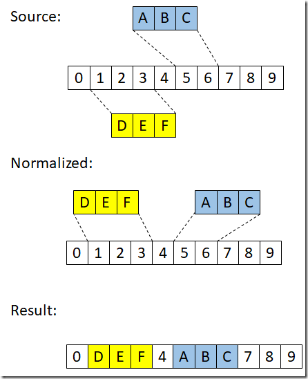

## JSON on steroids #2.2. Visual Studio Editor: ITextBuffer and related types

Let's continue our acquaintance with the basic functionality of text editors in Visual Studio.

Today I want to go through the contents of the **Microsoft.VisualStudio.Text.Data** package, which contains the types for the lowest-level text manipulation **ITextBuffer**, **ITextSnapshot**

If you are more or less oriented in the topic (approximately at the level of the article [Inside the editor](https://docs.microsoft.com/en-us/visualstudio/extensibility/inside-the-editor)), then you can skip the article with a clear conscience.

If you are more or less oriented in the topic (approximately at the level of the article Inside the editor), then you can skip the article with a clear conscience.

## Basic Types and Operations

The main type to start dancing from is, of course, [ITextBuffer](https://docs.microsoft.com/en-us/dotnet/api/microsoft.visualstudio.text.itextbuffer). If we take it as a basis and build a diagram of dependent and logically related types, we will get approximately the following picture


Next, let's briefly analyze their functions and roles.

## ITextBuffer

Those who have carefully studied the diagram, of course, will object "what about the Delete(), Insert() and Replace() methods" - that's right, such methods exist, but they behave a little unusually... However, more on this later.

The main idea behind the mechanics of ITextBuffer (we're talking about the exposed API now – how it works internally is not important to us) is the implementation of the "multiple readers, single writer" approach. This is achieved in the following way.

- The current state of ITextBuffer is represented as an immutable snapshot. It implements the ITextSnapshot interface, which can be retrieved through the CurrentSnapshot property of ITextBuffer

- To make changes to ITextBuffer:

  - the ITextBufferEdit interface is created (or rather, one of its successors, depending on what kind of changes are required)

  - the buffer itself is marked as editable (EditInProgress property == true) and all attempts to create a second instance of ITextBufferEdit are blocked

- All changes are committed via ITextBufferEdit. In this case, the current snapshot does not change

- When editing is complete, one of the ITextBufferEdit methods is called:
  - Cancel() - all accumulated changes are lost, ITextBuffer is unlocked (EditInProgress property == false)
  - Apply() – all accumulated changes are applied and a new snapshot is created. It replaces CurrentSnapshot and unlocks the buffer


In code, it will look something like this:

```cs
var textBuffer = ... // create an ITextBuffer containing "0123456789"
 
var edit = textBuffer.CreateEdit();
edit.Insert(edit.Snapshot.Length, "EFG");
edit.Replace(0, 3, "ABC");
edit.Apply();
 
var newSnapshot = textBuffer.CurrentSnapshot;
Assert.Equal("ABC3456789EFG", newSnapshot.GetText());
```

Thus, we get the following behavior:

- any thread can access the current snapshot at any time, and (if it keeps it for itself rather than accessing the CurrentSnapshot property every time) can be sure that the shanpshot will never be modified

- There can only be 1 "writer" at a time

- all changes are atomic and consistent (at least there is a mechanism to ensure this)

Now that we have a general understanding of "what is the beast of ITexrBuffer and what is it for", let's go through all the types in more detail

## Creating an ITextBuffer or Factory and Documents

Generally speaking, the situation when you need to create your own ITextBuffer inside the VS extension is rather an exception. In most scenarios, you're working with a pre-built object (or not even with ITextBuffer itself, but with something that uses it internally). However, the scenarios can be very different, so we will still spend some time on different scenarios for creating ITextBuffer

Initially, VS SDK (let me remind you that we are talking only about what is available through the **Microsoft.VisualStudio.Text.Data** package) offers 2 basic mechanisms for obtaining ITextBuffer:

- Creating an ITextBuffer directly – empty or based on an existing text string (in fact, there are many more options: create from another ITextBuffer or part of it, from a TextReader, ...). [ITextBufferFactoryService](https://docs.microsoft.com/en-us/dotnet/api/microsoft.visualstudio.text.itextbufferfactoryservice) is responsible for this option

- Read from a file. [ITextDocumentFactoryService](https://docs.microsoft.com/en-us/dotnet/api/microsoft.visualstudio.text.itextdocumentfactoryservice) is responsible for this

A natural question: what is the point of the second option, because you can always read the contents of the file into memory yourself, and then create a buffer using the first mechanism?

The answer is simple: in the second option, not just ITextBuffer the [ITextDocument](https://docs.microsoft.com/en-us/dotnet/api/microsoft.visualstudio.text.itextdocument), interface is created, which establishes a connection with the file open for editing and allows you to:

- save or reload ITextBuffer contents
- Track whether the buffer has changed since the last read/save
- Manage encoding to save
- etc.

By and large, the process of creating ITextBuffer/ITextDocument does not have any peculiarities. Perhaps the only 2 points that are worth paying attention to:

- both ITextBufferFactoryService and ITextDocumentFactoryService are MEF components

almost all methods of creating/retrieving ITextBuffer/ITextDocument require the IContentType (we talked about content types earlier, last article), and where it is not required, it is either predefined (for example, [this variant of the CreateTextBuffer() method](https://docs.microsoft.com/en-us/dotnet/api/microsoft.visualstudio.text.itextbufferfactoryservice.createtextbuffer#Microsoft_VisualStudio_Text_ITextBufferFactoryService_CreateTextBuffer) creates a buffer with ContentType == "text") or is taken from the context (as in [CreateTextDocument(ITextBuffer, String)](https://docs.microsoft.com/en-us/dotnet/api/microsoft.visualstudio.text.itextdocumentfactoryservice.createtextdocument) – here the ContentType is already set in ITextBuffer)

Below is a small example of using both factories, as well as an example of working with ITextDocument events and methods (the example is somewhat far-fetched – you should not look for a serious grain of benefit in it)

```cs
public class CreateBufferAndDocumentSample
{
    [Import]
    ITextBufferFactoryService textBufferFactoryService = null;
 
    [Import]
    ITextDocumentFactoryService textDocumentFactoryService = null;
 
    const string AutoSaveExt = ".bak";
 
    public ITextBuffer CreateTextBuffer(string text)
    {
        return textBufferFactoryService
            .CreateTextBuffer(text, textBufferFactoryService.TextContentType);
    }
 
 
    public ITextDocument CreateDocumentWithAutoSaving(string filePath)
    {
        var textDocument = textDocumentFactoryService
            .CreateAndLoadTextDocument(filePath, 
                            textBufferFactoryService.TextContentType);
 
        textDocument.DirtyStateChanged += TextDocument_DirtyStateChanged;
        textDocument.FileActionOccurred += TextDocument_FileActionOccurred;
 
        return textDocument;
    }
 
    private void TextDocument_FileActionOccurred(object sender, 
                     TextDocumentFileActionEventArgs e)
    {
        var textDocument = (ITextDocument)sender;
        if (e.FileActionType == FileActionTypes.ContentSavedToDisk)
            File.Delete(GetBackupFilePath(textDocument));
    }
 
    private void TextDocument_DirtyStateChanged(object sender, EventArgs e)
    {
        var textDocument = (ITextDocument)sender;
        if (textDocument.IsDirty)
            textDocument.SaveCopy(GetBackupFilePath(textDocument), true);
    }
 
    private static string GetBackupFilePath(ITextDocument textDocument)
    {
        return textDocument.FilePath + AutoSaveExt;
    }
}
```

## ITextSnapshot, points, spans and span collections

To begin with, let's note that ITextSnapshot implements 2 options for presenting text:

- An array of text without any processing. In this case, you just get all the symbols "as is" and implement all the processing yourself

- Line-by-line splitting. Here, the text is represented as an array of strings (the ITextSnapshotLine interface), taking into account the partitioning rules that VS applies to this text

The text itself can be retrieved as a string or an array of characters. There's also an out-of-the-box [TextSnapshotToTextReader](https://docs.microsoft.com/en-us/dotnet/api/microsoft.visualstudio.text.textsnapshottotextreader) adapter that implements the [TextReader](https://docs.microsoft.com/en-us/dotnet/api/system.io.textreader) interface over ITextSnapshot.


The next important point is how addressing/positioning is carried out within the text. Here it is mainly required to indicate:

- or position from the beginning of the text (Position/Point)

- or a fragment (Span), defined by 2 positions – the beginning and the end


In general, a position in the text is just a natural number. Therefore, they did not introduce a special type for it.

On the other hand, a special Span structure is used to represent the interval, which is interesting in the following ways:

- it is not tied to any text and is simply an abstract interval
- contains the [Start](https://docs.microsoft.com/en-us/dotnet/api/microsoft.visualstudio.text.span.start), [End](https://docs.microsoft.com/en-us/dotnet/api/microsoft.visualstudio.text.span.end), and [Length](https://docs.microsoft.com/en-us/dotnet/api/microsoft.visualstudio.text.span.length) of the interval, for which the following is true:

  - Positions are counted from 0

  - The structure specifies the interval, which is specified as [Start .. End) – i.e. the start boundary is included in the interval, but the end boundary is not

  - Start + Length = End

- has ready-made methods for
  - check that the position or other interval lies within the specified
  - Comparing intervals for equality
  - Obtain an intersection (i.e., a common part) and an overlap (i.e., a total of both the shared part and the individual part) for the two intervals

However, the problem with using such types (Span and Simple Int) is that they are detached from the specific text, and if we have calculated the position or interval for one snapshot, they may indicate something completely different or be invalid for another. In other words, a Position or Span only makes sense in the context of a particular ITextSnapshot. Therefore, the following two types have been added:

- [SnapshotPoint](https://docs.microsoft.com/en-us/dotnet/api/microsoft.visualstudio.text.snapshotpoint)
- [SnapshotSpan](https://docs.microsoft.com/en-us/dotnet/api/microsoft.visualstudio.text.snapshotspan)

Essentially, these are structures that contain the position (or interval) and the pointer to the Snapshot for which they were obtained. In addition, they implement methods of comparison and manipulation (for example, to shift a position by a given distance) with a check for admissibility (for example, for not going beyond the border of the Snapshot).

Here's a small example of working with ITextSnapshot and SnapshotSpan:

```cs
var text = "Sample: 0123456789";
var textBuffer = textBufferFactoryService.CreateTextBuffer(text,
    textBufferFactoryService.PlaintextContentType);
 
var snapshot = textBuffer.CurrentSnapshot;
var whiteSpacePosition = snapshot.GetText().IndexOf(' ');
 
var numberSpan = new SnapshotSpan(
    snapshot,
    new Span(whiteSpacePosition + 1, 
        snapshot.Length - whiteSpacePosition - 1));
 
Assert.Equal("0123456789", numberSpan.GetText());
```

Well, to conclude the topic about intervals and positions (in fact, we will return to them, but in the context of the history of text changes), it is necessary to say about two more classes:

- [NormalizedSpanCollection](https://docs.microsoft.com/en-us/dotnet/api/microsoft.visualstudio.text.normalizedspancollection)
- [NormalizedSnapshotSpanCollection](https://docs.microsoft.com/en-us/dotnet/api/microsoft.visualstudio.text.normalizedsnapshotspancollection)


The names are pretty self-explanatory – these are the Span and SnapshotSpan collections, which:

- All intervals are ordered by starting position

- adjacent and overlapping intervals are combined into one

That is, the sequence of intervals [4 .. 11), [13 .. 17), [1 .. 6), [0 .. 1) will be replaced by [0 .. 11), [13 .. 17)


```cs
var normalizedSpanCollection1 =
    new NormalizedSpanCollection(
        new Span[] {
            new Span(4, 7),  // [4 .. 11)
            new Span(13, 4), // [13 .. 17)
            new Span(1, 5),  // [1 .. 6)
            new Span(0, 1),  // [0 .. 1)
        });
 
var normalizedSpanCollection2 =
    new NormalizedSpanCollection(
        new Span[] {
            new Span(0, 11),  // [0 .. 11)
            new Span(13, 4)   // [13 .. 17)
        });
 
Assert.True(normalizedSpanCollection1 == 
          normalizedSpanCollection2);
```

And, of course, the collections themselves support operations (with similar collections) such as union, intersection, difference, ...

## Editing and read-only regions

And now we return to editing again, only now we will pay closer attention to it.

As mentioned earlier, an object is created for editing that implements the interface inherited from [ITextBufferEdit](https://docs.microsoft.com/en-us/dotnet/api/microsoft.visualstudio.text.itextbufferedit). There are 2 types of such interfaces, and different methods of the ITextBuffer interface are used to create them:


<table>
  <tbody>
    <tr>
      <th align="left">Sl. No.</th>
      <th align="left">Interface</th>
      <th align="left">Creation Method</th>
      <th align="left">Notes</th>
    </tr>
    <tr>
      <td align="left">1</td>
      <td align="left"><a href="https://docs.microsoft.com/en-us/dotnet/api/microsoft.visualstudio.text.itextedit">ITextEdit</a></td>
      <td align="left">CreateEdit</td>
      <td align="left">Used to modify the contents of ITextBuffer: insert, delete, and replace characters</td>
    </tr>
    <tr>
      <td align="left">2</td>
      <td align="left"><a href="https://docs.microsoft.com/en-us/dotnet/api/microsoft.visualstudio.text.ireadonlyregionedit">IReadOnlyRegionEdit</a></td>
      <td align="left">CreateReadOnlyRegionEdit</td>
      <td align="left">Used to create or delete non-editable areas of text - any changes to these areas will fail</td>
    </tr>
  </tbody>
</table>

The general scheme of working with both interfaces was described earlier:

- Create an editing object (by calling the method from the second column of the table)
- Call editing methods (each interface has its own) – without restrictions
- Finally, call Cancel() to cancel or Apply() to apply all changes to ITextBuffer

In general, everything is simple, but, as it often happens, there are a few nuances... Let's start with a more complex, but much more commonly used ITextEdit.

# ITextEdit

If you look at the first diagram in this article, you can see that this interface offers three (without taking into account overload) editing methods:

- Delete()
- Insert()
- Replace()

In principle, their names and semantics are quite transparent, so it would seem that it should be quite easy to guess, but if we take two seemingly similar code fragments:

Powered by ITextEdit

```cs
var text = "0123456789";
var textBuffer = textBufferFactoryService
    .CreateTextBuffer(text, textBufferFactoryService.PlaintextContentType);
 
var e = textBuffer.CreateEdit();
e.Insert(0, "DEF");
e.Insert(1, "ABC");
e.Delete(0, 3);
e.Apply();
 
var sn2 = textBuffer.CurrentSnapshot;
output.WriteLine(sn2.GetText());
```

Based on System.String

```cs
var text = "0123456789";
text = text.Insert(0, "DEF");
text = text.Insert(1, "ABC");
text = text.Remove(0, 3);

output.WriteLine(text);
```

Then for the string (i.e. the second example) we get quite the expected

```text
CEF0123456789
```

```txt
DEFABC3456789
```

What is the reason for such different behavior and such an unexpected result in the case of ITextEdit?

If you refer to the [ITextEdit, TextVersion, and text change notifications](https://docs.microsoft.com/en-us/visualstudio/extensibility/inside-the-editor#itextedit-textversion-and-text-change-notifications) section, you can find the following explanation (in my translation):

> The content of a text buffer can be changed by using an ITextEdit object. Creating such an object (by using one of the CreateEdit() methods of ITextBuffer) starts a text transaction that consists of text edits. Every edit is a replacement of some span of text in the buffer by a string. The coordinates and content of every edit are expressed relative to the snapshot of the buffer when the transaction was started. The ITextEdit object adjusts the coordinates of edits that are affected by other edits in the same transaction.

In general, it is already clear that the editing process is significantly different from what we are used to seeing for normal operations with strings, however, to understand how editing still works in ITextEdit, I suggest digging a little deeper.

For starters, the calls to the **Delete()/Insert()/Replace()** methods don't instantly change the contents of the ITextBuffer, instead they simply generate a list of modification operations. Moreover, deleting and inserting are converted to a replacement operation:

- **Delete(position, length) –> Replace(position, length, "")**

- **Insert(position, "text") –> Replace(position, 0, "text")**

In other words, each operation is:

- the interval to be replaced (for the insertion operation, it has 0 length, i.e. the start and end are the same)
- The row to be replaced with (it is empty for the delete operation)

Then, when **Apply()** is called, the list of changes is normalized and a new ITextBuffer state is generated. Actually, the whole point is in the normalization algorithm, namely:

- All modification operations are sorted by the initial position of the modified fragment, but taking into account the order of addition (i.e. if there were several operations with the same position, they will be next to each other, but in the order in which they were added)

- All operations in which the fragments to be replaced intersect or are adjacent to each other are combined into one operation. In this case, a total operation is obtained, which:

  - Original Interval == The area covered by the original operations. Or, in other words, the starting position is taken as the minimum of the initial starting positions, and the final position is taken as the maximum of the final ones
  - And the string with which the original interval needs to be replaced is the concatenation of rows from the original operations in the order they were in the list

The description turned out to be somewhat cumbersome, so I will try to explain with a few examples.

Suppose we have the original string

Example 1. The order is reversed, but the intervals do not overlap.

```cs
Replace(5, 2, “ABC”);
Replace(1, 3, “DEF”);
```




Example 2. Intervals start at a single position and are combined in order of addition:

```cs
Replace(1, 2, “ABC”);
Replace(1, 3, “DEF”);
```


And if you change the order of the operations, the result will be as follows:

```cs
Replace(1, 3, “DEF”);
Replace(1, 2, “ABC”);
```


Example 3. Multiple totally contiguous and/or overlapping intervals

```cs
Replace(5, 2, “ABC”);
Replace(1, 3, “DEF”);
Replace(4, 2, “ZXY”);
```


Of course, all this is a somewhat simplified description, but I hope it gives a general idea.

Before moving on to the next section, I want to note that ITextBuffer has very similar methods to ITextEdit Delete()/Insert()/Replace(). They are wrappers over an ITextEdit call with a single edit command

In other words, the code

```cs
var text = "0123456789";
var textBuffer = textBufferFactoryService
    .CreateTextBuffer(text, textBufferFactoryService.PlaintextContentType);
 
var sn = textBuffer.Insert(0, "DEF");
```

is equvalent to 

```cs
var text = "0123456789";
var textBuffer = textBufferFactoryService
    .CreateTextBuffer(text, textBufferFactoryService.PlaintextContentType);
 
var e = textBuffer.CreateEdit();
e.Insert(0, "DEF");
e.Apply();
 
var sn = textBuffer.CurrentSnapshot;
```

## IReadOnlyRegionEdit

This interface supports a rather specific scenario – declaring read-only intervals in the text. One example of using this interface is the C# Interactive window.


The entire area above the current line (i.e. execution history, output command results, ...) is a non-editable part. However, in the current line (the last line starting with ">"), all editing options are available.

Or the Output window – which is not fully editable


This implementation of this and similar windows allows you to get all the text management capabilities as in the usual editor (coloring, searching, copying to the clipboard, ...), but make the text (all or parts) read-only.

Actually, the whole idea of working with read-only regions boils down to a simple rule – if you (through the ITextEdit interface) try to specify an edit operation where the variable interval intersects at least partially with the read-only region, this operation is not used.

Otherwise, this is a fairly easy-to-use interface, for which an example is enough:

```cs
var text = "0123456789";
var textBuffer = textBufferFactoryService
    .CreateTextBuffer(text, textBufferFactoryService.PlaintextContentType);
 
var sn1 = textBuffer.CurrentSnapshot;
 
var ro1 = textBuffer.GetReadOnlyExtents(new Span(0, sn1.Length));
output.WriteLine("Region count :" + ro1.Count.ToString());
 
var roEdit = textBuffer.CreateReadOnlyRegionEdit();
roEdit.CreateReadOnlyRegion(new Span(0, 3));
roEdit.Apply();
 
var ro2 = textBuffer.GetReadOnlyExtents(new Span(0, sn1.Length));
output.WriteLine("Region count :" + ro2.Count.ToString());
 
var e = textBuffer.CreateEdit();
e.Replace(5, 2, "ABC");
e.Replace(1, 3, "DEF");
e.Apply();
 
var sn2 = textBuffer.CurrentSnapshot;
output.WriteLine("Result text :" + sn2.GetText());
```

As a result, we get:

```txt
Region count :0
Region count :1
Result text :01234ABC789
```

As you can see, the Replace(1, 3, "DEF") operation failed because it interfered with the read-only region [0 .. 3).

And finally, the last aspect that I want to talk about is the versions and history of changes.

If we look closely at ITextBuffer and ITextSnapshot, we can see that these two interfaces represent only the current state of the text. However, versioning and history are embedded in the text API, and at the lowest level.

The ITextVersion interface is responsible for working with versions, for which the following points are met:

- each version, except for the current one, stores a reference to the next version (the Next property), i.e. the chain of versions begins and grows towards later ones. Backlink is not stored

- in addition, each version (again, except the current one) stores a collection of Changes consisting of ITextChange elements – this is a collection of normalized changes that were applied when the next version was 
received (so the last version, i.e. the current version, has no changes)

- You can get a link to the current version through the current ITextSnapshot


It turns out that you can't just access the history of changes at any time – if you need it, then you need to save a link to the reference point you need in advance. On the other hand, this model (at least in theory – if no one else references the history) is to clear the memory occupied by the history in the GC.

Another important point is read-only history, i.e. these interfaces do not offer you an API for performing Undo. You won't even be able to change CurrentSnapshot to your previously saved CurrentSnapshot.

For those who need to work with Undo/Redo, I recommend understanding [ITextBufferUndoManagerProvider](https://docs.microsoft.com/en-us/dotnet/api/microsoft.visualstudio.text.operations.itextbufferundomanagerprovider)/[ITextBufferUndoManager](https://docs.microsoft.com/en-us/dotnet/api/microsoft.visualstudio.text.operations.itextbufferundomanager)

However, the version mechanism also has a quite practical application - it is tracking the position of a single position or a fragment of text between edits (in other words, Tracking).

The main class that performs tracking operations is quite expectedly called Tracking and contains, in fact, 4 methods (in fact, there are more of them, but all methods are overloaded versions of the same ones):

- TrackPositionBackwardInTime()
- TrackPositionForwardInTime()
- TrackSpanBackwardInTime()
- TrackSpanForwardInTime()

In fact, it is clear from the names that these methods calculate the position or interval by moving "backwards" (i.e., we essentially find out "as it was") or "forward" (i.e., "as it will be"). And the input of these methods is essentially the current version + the version to which we convert.

In general, everything is quite transparent, but... As usual, there are some nuances that are worth sorting out. From the point of view of where the changes occur, relative to the position or interval we are interested in, 3 options are possible:

- The change occurs after the position/interval – in this case, the coordinates of the position/interval do not change

- The change occurs before the position/interval – the position/interval is shifted by the value of the delta (for example, if a distance was applied, the delta will be negative, and all coordinates will decrease)

- The interval of changes is superimposed on our position/interval and here different options are possible...

Position tracking

If we **remove the** interval within which the tracked position is located, then it moves to the character next to the interval to be removed, and if the interval to be removed is the "tail" of the current text, then the pointer is placed after the last character:


```cs
An interesting point is that in the last variant (when after removing the "tail" the pointer stands on a non-existent symbol), an attempt to read the symbol in this position will not necessarily lead to an error (more precisely, there will be no error if a position with such an index existed before). I have never been able to establish this mere implementation feature or intentional behavior.
```

A little more interesting is the situation with insertion (when the insertion location is the tracked position) and replacement (when the fragment to be replaced covers the tracked position) – here we can control where the tracked position will move: to the beginning or end of the fragment to be inserted.

This behavior is affected by the [PointTrackingMode](https://docs.microsoft.com/en-us/dotnet/api/microsoft.visualstudio.text.pointtrackingmode) parameter, which has 2 values: Negative (put the pointer on the first inserted character) and Positive (put on the last inserted character):


interval tracking

Here you need to keep in mind the following - the interval is considered as a set of 2 boundaries: start and end - each of which behaves like a regular tracked position, i.e. there are 4 modes in total.

[The SpanTrackingMode](https://docs.microsoft.com/en-us/dotnet/api/microsoft.visualstudio.text.spantrackingmode) parameter is responsible for choosing how the boundaries of the tracked interval behave during insertion and replacement (when the boundary is inserted at the same location as the boundary or when the boundary falls within the interval being replaced), which has the following values:

- EdgeExclusive - only characters from the old interval should be included in the final interval and not newly inserted characters. To do this, the initial position of the interval works in the Positive mode, and the end position works in the Negative mode

- EdgeInclusive is the opposite of EdgeExclusive, i.e. all intersecting intervals are included in the original one. Therefore, boundaries are tracked in opposite modes: the beginning in Negative and the end in Positive

- EdgeNegative – Both boundaries in Negative mode

- EdgePositive – Both Borders in Pisitive Mode


ITrackingPoint and ITrackingSpan
It is clear that it is not always convenient to call the methods of the Tracking class manually (in fact, it is not difficult – just extra code: get the version under which the tracking started, get the current one, call tracking, ...)

Therefore, there are special interfaces in the API that simplify this: [ITrackingPoint](https://docs.microsoft.com/en-us/dotnet/api/microsoft.visualstudio.text.itrackingpoint) and [ITrackingSpan](https://docs.microsoft.com/en-us/dotnet/api/microsoft.visualstudio.text.itrackingspan). There are no special pitfalls in working with them, so to get acquainted with them, it is enough to demonstrate a simple example:

```cs
var text = "0123456789";
var textBuffer = textBufferFactoryService
    .CreateTextBuffer(text, textBufferFactoryService.PlaintextContentType);
 
var sn1 = textBuffer.CurrentSnapshot;
var position = sn1.CreateTrackingPoint(2, PointTrackingMode.Positive);
var span = sn1.CreateTrackingSpan(new Span(4, 3), SpanTrackingMode.EdgeInclusive);
 
textBuffer.Delete(new Span(0, 1));
textBuffer.Replace(new Span(5, 2), "WWWWWWW");
 
var sn2 = textBuffer.CurrentSnapshot;
output.WriteLine($"New position: {position.GetPosition(sn2)}");
output.WriteLine($"New span: {span.GetSpan(sn2).Span}");
```

## As a result

Of course, it is impossible to fit all the features and nuances provided by the Microsoft.VisualStudio.Text.Data package into one small article.

For example, I didn't say a word about the [IProjectionBuffer](https://docs.microsoft.com/en-us/dotnet/api/microsoft.visualstudio.text.projection.iprojectionbuffer) and [IElisionBuffer](https://docs.microsoft.com/en-us/dotnet/api/microsoft.visualstudio.text.projection.ielisionbuffer) interfaces (and the whole range of related types) that allow you to essentially collect text (projections) from different ITextBuffers and work with them as a single unit

However, what is stated in this article is quite enough to continue to deal with extensions for the JSON support mechanism in Visual Studio.

