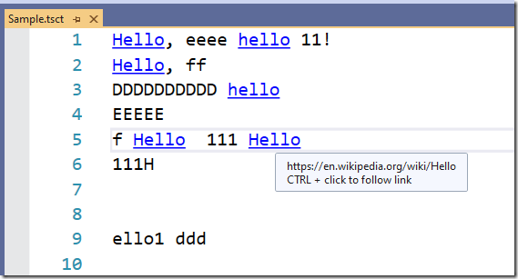
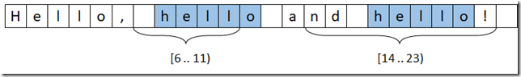

# JSON on steroids #2.3. Visual Studio Editor: Tags, classifiers and text formating. Part 1

As we continue to understand the mechanics of the Visual Studio Editor, today I'm going to move on to a slightly higher-level experience and talk about things like [tagging, classifying, and formatting text](https://docs.microsoft.com/en-us/visualstudio/extensibility/inside-the-editor#tags-and-classifiers).

In fact, this topic is extensive and I had to divide it into several parts, and in the first of them I propose to talk about such a basic mechanism as text tagging, which is used both independently and as a basis for other editor features.

In the meantime, we will also touch on various useful services related to text processing.

## Semantic markup or text tagging

The general idea behind this mechanism is quite simple, and overlaps with the ideas of [Smart Tags in MS Office](https://docs.microsoft.com/en-us/previous-versions/visualstudio/visual-studio-2010/ms178786(v=vs.100)):

- we take the source text and somehow highlight the fragments of interest (Span) in it. It can be absolutely any mechanism:

  - parser of the programming language (splits the entire text into tokens),

  - Search for special sequences (e.g., highlighting numbers, dates, or URLs)

  - manual text selection (roughly speaking, you select it with the mouse and select the "Mark" item in the context menu),
  - etc
 
- With each selected fragment, we match an object of a special type. It can act:

  - just a marker. For example, if we just highlight a word with a cursor on it, then there will be only one such fragment and we do not need any additional information about it,

  - or containing additional data. For example, we highlight fragments with errors, and as additional information goes: the severity of the error (error/warning/...) and the explanatory text that should be shown when hovering over the fragment with the error

- Well, then the text rendering mechanism takes the text itself and the list of tags, and forms the result, where the text is provided with various "adornments": from highlighting with color and font, then collapsing the text and/or drawing next to it or on top of various images or controls

## Simple Tagger and its factory

The tagging mechanism conceptually looks quite simple and is based on the implementation of 2 interfaces: ITagger<out T> and ITaggerProvider.

The main one of this pair is ITagger:

```cs
public interface ITagger<out T> where T : ITag
{
   event EventHandler<SnapshotSpanEventArgs> TagsChanged;
 
   IEnumerable<ITagSpan<T>> 
            GetTags(NormalizedSnapshotSpanCollection spans);
}
```

is the "heart" of your tagging mechanism: the class that implements this interface will be responsible for tagging the text.

However, Visual Studio does not directly create the Tagger, but accesses the factory that implements the ITaggerProvider interface:

```cs
public interface ITaggerProvider
{
    ITagger<T> CreateTagger<T>(ITextBuffer buffer) where T : ITag;
}
```

To avoid going around in circles for a long time, let's look at one simple example of implementing tagging.

Example

Let's start with a problem in which we search for the word "hello" (not case-sensitive, but only the whole word, i.e. hello1 – we'll skip it) and add the [IUrlTag](https://docs.microsoft.com/en-us/dotnet/api/microsoft.visualstudio.text.tagging.iurltag) to it, which will link to the Wiki page https://en.wikipedia.org/wiki/Hello

First, let's take a look at the ITagger implementation:

```cs
public class HelloUrlTagger : ITagger<IUrlTag>
{
    private readonly ITextSearchService2 textSearchService;
 
    public HelloUrlTagger(ITextSearchService2 textSearchService)
    {
        this.textSearchService = textSearchService;
    }
 
    public event EventHandler<SnapshotSpanEventArgs> TagsChanged;
 
    public IEnumerable<ITagSpan<IUrlTag>> 
              GetTags(NormalizedSnapshotSpanCollection spans)
    {
        var snapshot = spans[0].Snapshot;
        var fullSnapshotSpan = new SnapshotSpan(snapshot, 
                new Span(0, snapshot.Length));
 
        var helloWords = textSearchService
                .FindAll(fullSnapshotSpan, "hello", FindOptions.WholeWord);
 
        return helloWords
            .Where(s => spans.IntersectsWith(s))
            .Select(s => new TagSpan<IUrlTag>(s, 
                new UrlTag(new Uri("https://en.wikipedia.org/wiki/Hello"))));
    }
}
```

The second class is the ITaggerProvider factory, which will create an instance of our HelloUrlTagger:

```cs
[Export(typeof(ITaggerProvider))]
[TagType(typeof(IUrlTag))]
[ContentType(Constants.ContentTypes.TestContentType)]
public class HelloUrlTaggerProvider : ITaggerProvider
{
    [Import]
    public ITextSearchService2 TextSearchService { get; set; }
 
    public ITagger<T> CreateTagger<T>(ITextBuffer buffer) where T : ITag
    {
        return (ITagger<T>) new HelloUrlTagger(TextSearchService);
    }
}
```

If we now build a VSIX project in which these types will be declared and start debugging it (or install it on the production version of the studio), we will get something like this (you can't see the cursor in the screenshot, but it is on the highlighted line, on the last word "Hello"):



How it works...

Let's start with the HelloUrlTaggerProvider factory. Pay attention to how it is announced, namely:

- HelloUrlTaggerProvider is a MEF component that implements (and exports!) the ITaggerProvider interface

- in addition to the [Export] attribute, it has 2 more markups:

  - [TagType] – we use it to specify which tags our provider supports
  - [ContentType] – because we want our provider to work only for certain content (you can read about content types in the article)

The provider is created 1 time, and then, to get an instance of ITagger (for the content type or its successor), the CreateTagger() method will be called. What points are important here:

- the CreateTagger() method is called 1 time for the ITextBuffer instance (which it receives as input). Next, our ITagger decides how exactly it will collect and update information about tags:

  - parse the text every time it is accessed (in the GetTags() method, as in our example)

  - subscribe to the ITextBuffer change event

  - use a ready-made parser that can calculate the difference when changing the text

  - …

- the ITagger itself is not a MEF component, so if it needs some services to work, the factory usually imports them and then passes them when ITagger is initialized (in this case, ITextSearchService2)

Now a few words about HelloUrlTagger

All the useful logic is concentrated in the GetTags() method, which takes a collection of normalized intervals as input (we talked about normalized intervals in the previous article), and outputs a list of tags that intersect with any of the intervals in the passed collection.

For example, if there is the text "Hello, hello and hello!" and GetTags() is called on the collection { [ 6 .. 11 ), [ 14 .. 23 ) }, then we should tag the second and third "hello":



Theoretically, it is possible to "extend" the requested intervals so that they cover whole words and then search within these "extended" intervals, but we do it easier:

- Find all occurrences of the word "hello". To do this, we use a ready-made search service [ITextSearchService2](https://docs.microsoft.com/en-us/dotnet/api/microsoft.visualstudio.text.operations.itextsearchservice2)
- From them, select those whose intervals intersect with intervals from the transferred collection

## Everything seems to be fine, but...

So, we have the first working version, but there are clearly two questions about it, of which there are:

- What is [the TagsChanged](https://docs.microsoft.com/en-us/dotnet/api/microsoft.visualstudio.text.tagging.itagger-1.tagschanged) event for?

- and is it possible to implement the GetTags() method more efficiently?
To answer them, let's understand how and when Visual Studio accesses our ITagger.

Unfortunately, I could not find accurate (and even approximate!) information on this matter. All I can offer is the result of my experiments, as well as the analysis of examples in [Visual Studio Extensibility Samples.](https://github.com/microsoft/VSSDK-Extensibility-Samples)


### About GetTags()

Here are a few examples (once again, this behavior is not declared anywhere and can change at any time) where and how GetTags() can be called:

- when opening a document, GetTags() is called sequentially for each line (for me, by the way, this turned out to be quite unexpected, I thought there would be one call for the entire text)

- if the user changes something in the text, GetTags() is called for each change operation (and even if block editing is used, the call is made separately for each fragment)

- if the IRtfBuilderService is called, it retrieves text-formatting-related tags (e.g., classification tags) for the fragment that is being translated into RTF

In general, GetTags() can be called repeatedly for the same snapshot, and if you call the tagging anew each time, the speed and efficiency will inevitably suffer.

How can this problem be solved?

### Caching and tracking

The first optimization that suggests itself is to cache the computed tags and remember the snapshot for which they were calculated, and then:

- If tags are requested for the same snapshot, return them from the cache
- If the snapshot has changed, refresh the entire cache

```cs
public class HelloUrlTagger2 : ITagger<IUrlTag>
{
    private readonly ITextSearchService2 textSearchService;
    private ITextSnapshot lastTaggedSnapshot = null;
    private IReadOnlyCollection<ITagSpan<IUrlTag>> tagSpans = null;
 
    public HelloUrlTagger2(ITextSearchService2 textSearchService)
    {
        this.textSearchService = textSearchService;
    }
 
    public event EventHandler<SnapshotSpanEventArgs> TagsChanged;
 
    public IEnumerable<ITagSpan<IUrlTag>> 
              GetTags(NormalizedSnapshotSpanCollection spans)
    {
        if (spans.Count == 0)
            return Enumerable.Empty<ITagSpan<IUrlTag>>();
 
        var currentSnapshot = spans[0].Snapshot;
        if (currentSnapshot != lastTaggedSnapshot)
        {
            UpdateTags(currentSnapshot);
        }
 
        return tagSpans.Where(s => spans.IntersectsWith(s.Span));
    }
 
    private void UpdateTags(ITextSnapshot currentSnapshot)
    {
        var fullSnapshotSpan = new SnapshotSpan(currentSnapshot, 
                 new Span(0, currentSnapshot.Length));
        var helloWords = textSearchService
               .FindAll(fullSnapshotSpan, "hello", FindOptions.WholeWord);
 
        tagSpans = new ReadOnlyCollection<TagSpan<IUrlTag>>(
            helloWords.Select(s => 
                new TagSpan<IUrlTag>(s, 
                    new UrlTag(new Uri("https://en.wikipedia.org/wiki/Hello"))))
            .ToList());
 
        lastTaggedSnapshot = currentSnapshot;
    }
}
```

The solution looks simple, but... has its drawbacks, the main of which is that we a priori believe that if we received a different snapshot (not the one we previously remembered), it means that there have been changes in the TextBuffer and there will never be a return to the previous snapshots.

It is easy to imagine a situation when this is not the case – it is enough to run some background process in parallel with editing, which will work with one snapshot (which is logical and very convenient) and will periodically call our Tagger with this "old" snapshot.

To combat this problem, let's change our scheme a little:

- cause a tag collection to be rebuilt only if there have been changes to ITextBuffer since the last build. To do this, every time we access the GetTags() method, we will look at the CurrentSnapshot on the TextBuffer, and call a recalculation only if it has changed

- if the snapshot for which the tag set is requested does not match the current one in ITextBuffer, then simply calculate the position of the tags in the requested snapshot. Why store a collection of tags as a TrackingTagSpan
This is how such a solution may look like:


```cs
using Microsoft.VisualStudio.Text;
using Microsoft.VisualStudio.Text.Operations;
using Microsoft.VisualStudio.Text.Tagging;
using System;
using System.Collections.Generic;
using System.Collections.ObjectModel;
using System.Linq;
 
namespace VSIXResearch.EditorFeatures.Tagging
{
    public class HelloUrlTagger2 : ITagger<IUrlTag>
    {
        private readonly ITextBuffer buffer;
        private readonly ITextSearchService2 textSearchService;
        private ITextSnapshot lastTaggedSnapshot = null;
        private IReadOnlyCollection<TrackingTagSpan<IUrlTag>> tagSpans = null;
 
        public HelloUrlTagger2(ITextBuffer buffer, ITextSearchService2 textSearchService)
        {
            this.buffer = buffer;
            this.textSearchService = textSearchService;
        }
 
        public event EventHandler<SnapshotSpanEventArgs> TagsChanged;
 
        public IEnumerable<ITagSpan<IUrlTag>> GetTags(NormalizedSnapshotSpanCollection spans)
        {
            if (spans.Count == 0)
                return Enumerable.Empty<ITagSpan<IUrlTag>>();
 
            var currentSnapshot = buffer.CurrentSnapshot;
            if (currentSnapshot != lastTaggedSnapshot)
            {
                UpdateTags(currentSnapshot);
            }
 
            var requestedSnapshot = spans[0].Snapshot;
            return tagSpans
                .Select(s => new TagSpan<IUrlTag>(
                             s.Span.GetSpan(requestedSnapshot), s.Tag))
                .Where(s => spans.IntersectsWith(s.Span));
        }
 
        private void UpdateTags(ITextSnapshot currentSnapshot)
        {
            var fullSnapshotSpan = 
                   new SnapshotSpan(currentSnapshot, new Span(0, currentSnapshot.Length));
            var helloWords = 
                   textSearchService.FindAll(fullSnapshotSpan, "hello", FindOptions.WholeWord);
 
            tagSpans = new ReadOnlyCollection<TrackingTagSpan<IUrlTag>>(
                helloWords
                    .Select(s => currentSnapshot.
                                CreateTrackingSpan(s, SpanTrackingMode.EdgeExclusive))
                    .Select(s => new TrackingTagSpan<IUrlTag>(
                                 s, new UrlTag(new Uri("https://en.wikipedia.org/wiki/Hello"))))
                    .ToList());
 
            lastTaggedSnapshot = currentSnapshot;
        }
    }
}
```

### TagsChanged event

This event allows you to implement a scenario where the composition of tags (or the values stored in them) changes without changing the text, for example:

- Tags are created or updated by a background thread
- Tags appear as a result of user actions, such as mouse highlighting

As an illustration, you can look at an example such as the [Highlight Word Sample](https://github.com/microsoft/VSSDK-Extensibility-Samples/tree/master/Highlight_Word), in which all words equal to the word on which the mouse cursor is hovered are highlighted.


