# JSON on steroids #2.3.Visual Studio Editor: Tags, classifiers and text formating. Part 2.

Today I would like to continue the topic of tags/classifiers/formatting in the Visual Studio editor and talk not about the basis of the tagging mechanism itself, but about its application in practice.

Today, we're going to take a quick look at the tags supported by the out-of-the-box editor. What do I mean? For all of the tags we're going to see today, some editor-side behavior is supported, meaning you only need to write the appropriate Tagger and mark up the text to use them, and the editor will take care of the rest.

Let's deal with each tag separately, but first I want to note that in addition to the VS SDK, the examples may contain code from VSIX Community (github.com)

## UrlTag

This tag maps the specified hyperlink to a piece of text. The fragment itself also begins to appear as a link (blue underlined text), and by clicking on it with Ctrl press, you can go to this link.

```cs
protected override IUrlTag CreateTag(SnapshotSpan snapshotSpan)
{
   return new UrlTag(new System.Uri(
          $"https://yandex.ru/search/?text={snapshotSpan.GetText()}"));
}
```

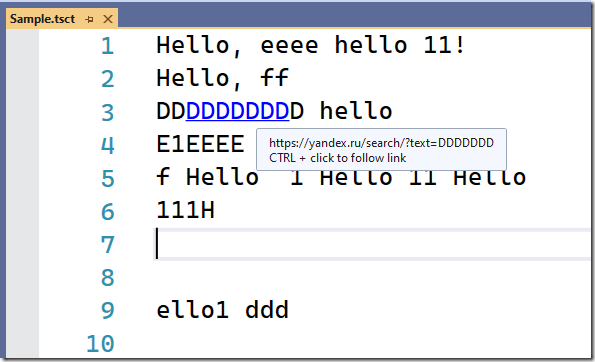

Most often, a set of constants from the PredefinedErrorTypeNames class is used to describe the type of error.

This is what the different types of errors look like (the tag is applied to a piece of text starting with the third "D"):

<table>
  <tbody>
    <tr>
      <th align="left">Sl. No.</th>
      <th align="left">Meaning</th>
      <th align="left">Example Description</th>
    </tr>
    <tr>
      <td align="left">1</td>
      <td align="left">Compiler Error</td>
      <td align="left">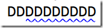</td>
    </tr>
    <tr>
      <td align="left">2</td>
      <td align="left">Syntax Error</td>
      <td align="left">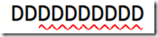</td>
      </td>
    </tr>
    <tr>
      <td align="left">3</td>
      <td align="left">Warnings</td>
      <td align="left"></td>
    </tr>
    <tr>
      <td align="left">4</td>
      <td align="left">Other Error</td>
      <td align="left">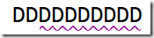</td>
    </tr>
    <tr>
      <td align="left">5</td>
      <td align="left">Hinted Suggestion</td>
      <td align="left">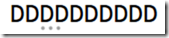</td>
    </tr>
    <tr>
      <td align="left">6</td>
      <td align="left">Suggestion</td>
      <td align="left">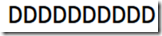<p>This type doesn't have a visualization in the text itself, but a tooltip pops up on hover, i.e. it's a method of simply adding a tooltip to free text.</p></td>
    </tr>
  </tbody>
</table>

As you understand, the very method of describing the error type in the form of a string constant (and not, for example, an enumerated type) leaves the possibility of extending the error type by adding a custom type. But we will postpone the discussion of all types of extensions for the next article.

## ClassificationTag

In general, classification in the VS editor is understood as a mechanism for allocating language tokens (identifiers, function words, comments, ...) and for this purpose a separate [IClassifier](https://docs.microsoft.com/en-us/dotnet/api/microsoft.visualstudio.text.classification.iclassifier)/[IClassifierProvider](https://docs.microsoft.com/en-us/dotnet/api/microsoft.visualstudio.text.classification.iclassifierprovider) mechanism is usually used. This mechanism is almost one-to-one identical to the mechanism of tags, with the only difference being that it is tailored to a single type of "tagging".

ClassificationTag, this mechanism, is in a sense duplicated (in fact, as far as I can tell, what IClassifier outputs internally is converted to ClassificationTags) and, probably, in most cases it makes no sense to use ClassificationTags, but for the sake of general picture, we will still mention it.

A feature of ClassificationTag is that it waits for a description of which class the tagged fragment belongs to in the form of [IClassificationType](https://docs.microsoft.com/en-us/dotnet/api/microsoft.visualstudio.text.classification.iclassificationtype). Getting an instance of IClassificationType for your own classifiers requires a few steps, but if you're talking about the most basic classifiers, you can use the [IStandardClassificationService](https://docs.microsoft.com/en-us/dotnet/api/microsoft.visualstudio.language.standardclassification.istandardclassificationservice).

For example, if we choose to mark pieces of text simply as a Keyword, the corresponding code will look like this:

```cs
protected override IClassificationTag CreateTag(SnapshotSpan snapshotSpan)
{
    var keyword = Package.JoinableTaskFactory
        .Run(() => VS.Shell.GetComponentModelAsync())
        .GetService<IStandardClassificationService>()
        .Keyword;
 
    return new ClassificationTag(keyword);
}
```

And outwardly like this

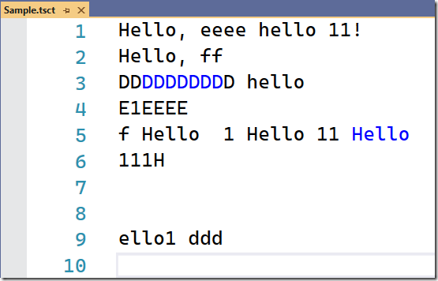

One of the important points is that the display of classification elements (as well as some other types of tags) can be controlled through the Fonts and Colors settings

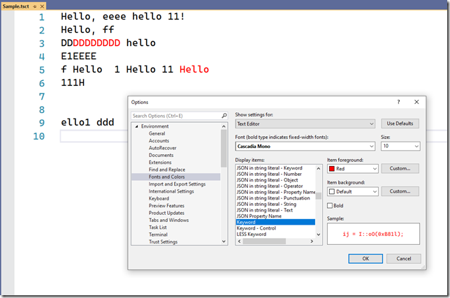

### OverviewMarkTag and TextMarkerTag

The next 2 tags are very similar to each other and are intended for arbitrary text labeling (unlike the previous ClassificationTag, which is bound to text elements of different types).

The difference between them is that

- TextMarkerTag is a highlight of the text itself

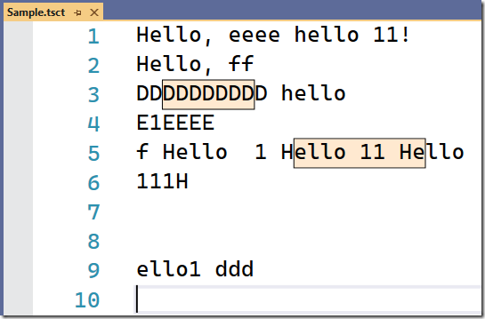

OverviewMarkTag – marking in the margins (see the right margin with a scroller)

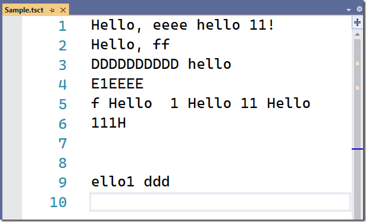

Before creating such tags, you need to describe the formatting settings. Something like this.

```cs
[Export(typeof(EditorFormatDefinition))]
[Name(Constants.FormatDefinitions.DemoFormatName)]
[UserVisible(true)]
class DemoTaggerFormatDefinition : EditorFormatDefinition
{
    protected DemoTaggerFormatDefinition()
    {
        BackgroundColor = Colors.Bisque;
        ForegroundColor = Colors.Black;
 
        DisplayName = "Demo tagger mark format";
    }
}
```

After that, it will be enough to refer to the name of this description, which is specified in the [Name] attribute, when creating a tag:

```cs
protected override ITextMarkerTag CreateTag(SnapshotSpan snapshotSpan)
{
    return new TextMarkerTag(
           Constants.FormatDefinitions.DemoFormatName);
}
```

and

```cs
protected override IOverviewMarkTag CreateTag(SnapshotSpan snapshotSpan)
{
    return new OverviewMarkTag(
           Constants.FormatDefinitions.DemoFormatName);
}
```

Well, the user will have the opportunity to change the default settings (as in the case of classification)

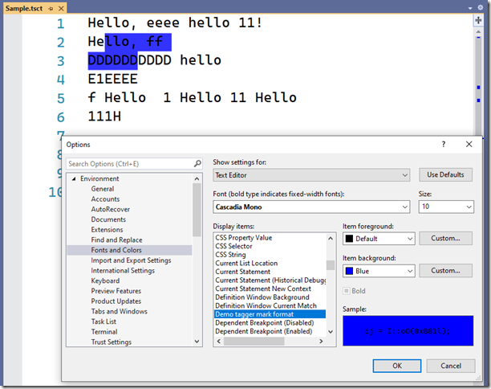

A more detailed consideration will again be postponed for a while.

## SpaceNegotiatingAdornmentTag and IntraTextAdornmentTag

These 2 tags are used to add all sorts of "adorments" around the text.

Examples include CodeLens

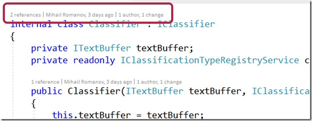

Or a color hint in the CSS editor

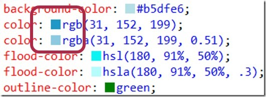

Since adorments are technically just a WPF element, your options for "decorating" are almost unlimited.

Returning to the tags themselves, it should be said that although they solve the same problem in general, they do it in slightly different ways:

- SpaceNegotiatingAdornmentTag – only reserves space within the text (by expanding lines or characters within the line) for a future "decoration", which is then added separately.

- IntraTextAdornmentTag – immediately both reserves and adds a WPF element to the reserved space

In fact, it would be more correct to say that these tags do not "expand", but replace the fragment of text to which they are applied (but at the same time, the space occupied by the fragment can be increased or decreased, depending on the size of the "decoration") - which means that if the task is to "expand" without changing the source text, it is necessary to apply the tag to an empty fragment.

Well, and the actual examples.

## IntraTextAdornmentTag

```cs
protected override IntraTextAdornmentTag CreateTag(SnapshotSpan snapshotSpan)
{
    var circle = new Ellipse()
    {
        Fill = new SolidColorBrush(Colors.Red),
        Height = 14,
        Width = 14,
        Stretch = Stretch.Fill
    };
    return new IntraTextAdornmentTag(circle, null);
}
```

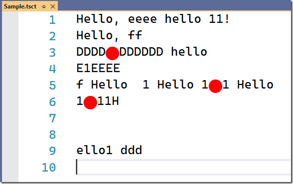


SpaceNegotiatingAdornmentTag (it is difficult to see in the image "for the reserved" space - so I will point out that it is on the 3rd line inside the line "DDDDDDDDDDDD" and on the 5th line in the last "Hello" - although in the picture they are indistinguishable from ordinary spaces)

```cs
protected override SpaceNegotiatingAdornmentTag CreateTag(SnapshotSpan snapshotSpan)
{
    return new SpaceNegotiatingAdornmentTag(
          20, 0, 0, 0, 0, PositionAffinity.Predecessor, null, null);
}
```

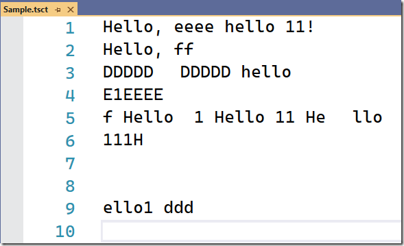

### OutliningRegionTag

Well, the last of the tags considered today allows you to "collapse" individual fragments of the text

In the simplest case, the use of this tag looks like this:

```cs
protected override IOutliningRegionTag CreateTag(SnapshotSpan snapshotSpan)
{
    return new OutliningRegionTag();
}
```

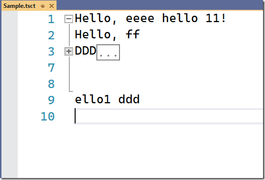

In this case, the collapsed region looks like an ellipsis, and no tooltip is shown when hovering over it.

However, this behavior can be changed and specify both the WPF object that will be drawn instead of the collapsed region, and the content of the tooltip (you can also use arbitrary WPF, but more often you specify just text, and VS draws it in the tooltip):

```cs
protected override IOutliningRegionTag CreateTag(SnapshotSpan snapshotSpan)
{
    var circle = new Ellipse()
    {
        Fill = new SolidColorBrush(Colors.Red),
        Height = 14,
        Width = 14,
        Stretch = Stretch.Fill
    };
    return new OutliningRegionTag(circle, snapshotSpan.GetText());
}
```

One of the unexpected (and, frankly, not very pleasant) surprises of this particular tag is that, unlike other tags that are stored only as long as the corresponding document is open, collapse tags are stored on disk, a subfolder of .vs inside the solution. That is, it will survive even the closure of the studio (but, they are reset if at the time when the file was closed in the studio it was changed from the outside)

In general, this behavior is understandable, because it both speeds up the work and saves the developer of the region mechanism from adding region state storage for his language/editor, but makes it necessary to add "cleanup" regions (if necessary, of course).

### Conclusion

Alas, it is not possible to tell everything and about all the tags within one article.

Some of the information will be presented in subsequent articles, and some of it, alas...

For example, I have not been able to understand the mechanisms of the StructureTag (and all the very considerable infrastructure around it), if you have a good description, I will be grateful for links in the comments.


## Reference

1. https://mihailromanov.wordpress.com/2022/07/10/json-on-steroids-2-3-visual-studio-editor-tags-classifiers-and-text-formating-part-2/

 


