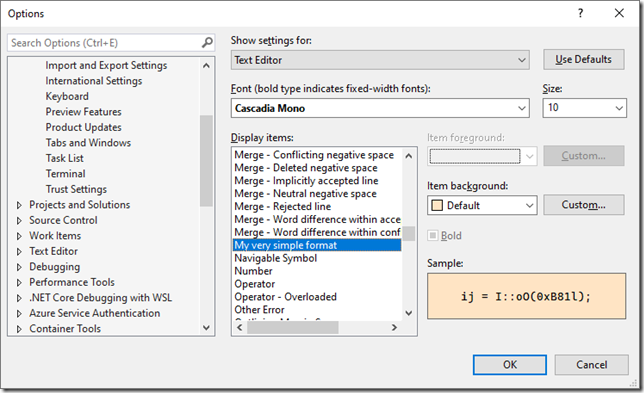
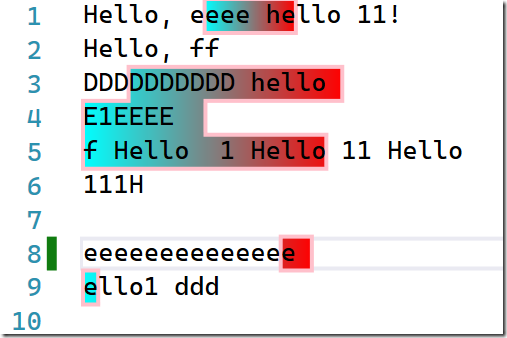

# JSON on steroids #2.3.Visual Studio Editor: Tags, classifiers and text formating. Part 3.

Well, to conclude the topic of tags/classifiers/formatting, I suggest talking about the latter, i.e. formatting.

And speaking of formatting, we will have to deal with 2 questions:

- How to set formatting options
- How these settings apply to text

Formatting options

Before we dive into how formatting work(s) in Visual Studio, let's try to figure out what we (as developers and as users) would like to get out of it.

First of all, obviously, it must somehow set the settings for the appearance of the text: font, size, color, style, ...

Second, it should somehow allow you to combine different formatting rules if they apply to the same piece of text. For example, the same fragment:

- only highlighting of various language elements (classification)


- In addition to classification, elements for which there are warnings are underlined, and one word is simply selected manually in the editor


- and here 3 rules are combined at once (for the standardClassificationService variable): classifier, warning and highlighting of the search result


Third, users should be able to change (at least partially) these rules to suit their preferences, such as changing the color of the identifiers


Probably, other tasks arose during the design, but for us these three will be a priority, and we will talk about formatting rules in the context of them.

Well, let's get started...

### EditorFormatDefinition and its descendants

So, when the VisualStudio editor needs information about text formatting (although this is not entirely accurate, since the mechanism described below can be used and is used in a few more scenarios), it turns to the MEF catalog, where it searches for all exports of type [EditorFormatDefinition.](https://docs.microsoft.com/en-us/dotnet/api/microsoft.visualstudio.text.classification.editorformatdefinition)

For example, one of the simplest such ads might look like this:

```cs
[Export(typeof(EditorFormatDefinition))]
[Name("my simple format defintion")]
class MyFormatDefinition : EditorFormatDefinition
{
    protected MyFormatDefinition()
    {
        BackgroundColor = Colors.Bisque;
        ForegroundColor = Colors.Green;
    }
}
```

What is important here:

- we declare our type, which is a descendant of EditorFormatDefinition, in the constructor of which we initialize the properties responsible for the appearance of the text (in this case, the text color and background color).

- mark the type as exportable EditorFormatDefinition

- be sure to specify the name ([Name] attribute) - this is what we will use to refer to the desired set of formatting rules

The question immediately arises: What display parameters can we control here?

To answer this question, I suggest taking a look at the following class diagram, which shows the 3 classes described in the documentation ([EditorFormatDefinition](https://docs.microsoft.com/en-us/dotnet/api/microsoft.visualstudio.text.classification.editorformatdefinition), [ClassificationFormatDefinition](https://docs.microsoft.com/en-us/dotnet/api/microsoft.visualstudio.text.classification.classificationformatdefinition), and [MarkerFormatDefinition](https://docs.microsoft.com/en-us/dotnet/api/microsoft.visualstudio.text.classification.markerformatdefinition)):


If you take a closer look at each of the classes (both the composition of the fields and the name), you will generally understand their purpose, or more precisely, which of the classes you need to inherit from, when declaring your own Format Definition:

- **EditorFormatDefinition** – Color only (or a pair of colors, such as font and background). This is quite enough, for example, for:

  - highlighting errors and warnings (the color of the line that underlines the fragment with the error/warning),

  - Setting the color of the labels on the margins and on the scroll bar

    

  - specifying the color for the primary/secondary cursor (this is if you use block editing, you can see that each line has its own cursor, but the cursor color on the current line is different)

    

- **MarkerFormatDefinition** is used for all kinds of text selections in the editor, when it is enough to specify 2 characteristics: a frame (color, thickness, line pattern, ...) and a brush (i.e. color, pattern, fill method, ...) to fill the background. And ZOrder allows you to resolve a conflict when multiple formats are applied to a fragment at once. For example, this is used for:

  - simple manual text selection (with the mouse or keyboard)
  - highlighting search results
  - …

- ClassificationFormatDefinition is the most complete set of characteristics, and in addition to color, there are font settings (family, size, style), background transparency, and a few more.

### User Settings

Discussing what properties the formatting parameters control mechanism should have, we mentioned an important aspect – setting / changing parameters by the user. Let's take a look at how this is implemented in Visual Studio and how it is projected onto the mechanism described above.

To control the display of text in the editor in VS, use the Options/Environment/Fonts and Colors/Text Editor section:


However, this dialog was developed long before the current formatting mechanisms appeared, and corresponds to them very conditionally, namely.

- the font family and size settings are set for the editor as a whole (although in the same ClassificationFormatDefinition you can set them for each class separately)

- Individual for each item are set: background color, font color and "boldness"

Conclusion – a very limited set of settings is available to the user to change. However, we need to understand how to provide him with at least what is possible.

### Make visible

The first question is: how do we make our formatting settings appear in the **Dispaly items** list and under what name?

The answers are as follows:

- add the [UserVisible](https://docs.microsoft.com/en-us/dotnet/api/microsoft.visualstudio.text.classification.uservisibleattribute) attribute to the declaration of the descendant class from EditorFormatDefinition

- Name the [DisplayName](https://docs.microsoft.com/en-us/dotnet/api/microsoft.visualstudio.text.classification.editorformatdefinition.displayname) property

In other words, to supplement the example above to get

```cs
[Export(typeof(EditorFormatDefinition))]
[Name("my simple format defintion")]
[UserVisible(true)]
class MyFormatDefinition : EditorFormatDefinition
{
    protected MyFormatDefinition()
    {
        BackgroundColor = Colors.Bisque;
        ForegroundColor = Colors.Green;
 
        DisplayName = "My very simple format";
    }
}
```

As a result, we will get this element


Sometimes in the process of debugging (in debugging, i.e. if you install your extension with a regular VSIX package), you may encounter the fact that the changes you make in MEF components are not "picked up" by the debugging version of Studio (and neither rebuilding nor restarting Experimental Studio helps)

One of the solutions is to uninstall your extension from the debugging studio and rebuild it from 0 (at this point it will be reinstalled), but as for me, it is better to install [the Clear MEF Component Cache](https://marketplace.visualstudio.com/items?itemName=MadsKristensen.ClearMEFComponentCache) extension and just reset the component cache.

In principle, the **DispalyName** property can be omitted—in this case, the name will be taken from the **[Name]** attribute

### What you can customize

The second question is which of the many fields in the EditorFormatDefinition and its descendants will be available for the user to configure. The answer is pretty obvious:

- ForegroundColor (from EditorFormatDefinition)
- BackgroundColor (from EditorFormatDefinition)
- IsBold (from ClassificationFormatDefinition)

Note that all of these properties are declared as Nullable, which means that you can explicitly specify the "property not set" situation.

There are 2 more useful properties in the EditorFormatDefinition class:

- [ForegroundCustomizable](https://docs.microsoft.com/en-us/dotnet/api/microsoft.visualstudio.text.classification.editorformatdefinition.foregroundcustomizable)
- [BackgroundCustomizable](https://docs.microsoft.com/en-us/dotnet/api/microsoft.visualstudio.text.classification.editorformatdefinition.backgroundcustomizable)

Allow you to explicitly hide one of the colors from user changes:


```cs
[Export(typeof(EditorFormatDefinition))]
[Name("my simple format defintion")]
[UserVisible(true)]
class MyFormatDefinition : EditorFormatDefinition
{
    protected MyFormatDefinition()
    {
        BackgroundColor = Colors.Bisque;
        ForegroundColor = Colors.Green;
 
        DisplayName = "My very simple format";
        ForegroundCustomizable = false;
    }
}
```

Will give the result:



## Simplest formatting options

It's time to put together what we talked about in [the last article](https://mihailromanov.wordpress.com/2022/07/10/json-on-steroids-2-3-visual-studio-editor-tags-classifiers-and-text-formating-part-2) (about standard tags) and what we described just above.

Despite the fact that the general scheme of working with format handles in the simplest looks the same, i.e.:

- A format descriptor is declared
- is written Tagger, which, with one of the tag parameters, specifies the name of the format descriptor

But (!) depending on what kind of tags they are, there will be some nuances of application, which we will consider below for each type of tags separately.

## IOverviewMarkTag

This is probably the easiest option, because it uses only 1 parameter from the format - the background color

Therefore, to inherit the format descriptor, it is enough to take the EditorFormatDefinition and disable the Foreground color settings.

Specifier:


```cs
[Export(typeof(EditorFormatDefinition))]
[Name(Constants.FormatDefinitions.OverviewMarkFormatName)]
[UserVisible(true)]
class OverviewMarkFormatDefinition : EditorFormatDefinition
{
    protected OverviewMarkFormatDefinition()
    {
        BackgroundColor = Colors.Bisque;
        ForegroundCustomizable = false;
 
        DisplayName = "Demo: overview mark";
    }
}
```

Creating a tag:

```cs
new OverviewMarkTag(Constants.FormatDefinitions.OverviewMarkFormatName);
```

Result (2 marks on the right scroller + settings named "Demo: overview mark"):


### ITextMarkerTag

It's a little more complicated here...

As the name implies, TextMarkerTag is used to select/mark/highlight text fragments. The selection area has 2 components: the background and the border. At the same time, if you select text on several lines, and the selection areas touch, then they are combined into a common shape, with a single border.

For example, 
- (a) only in the first line, 
- (b) part of line 3, all of 4 and part of 5 – the areas are touching, 
- (c) the end of 8 and the beginning of 9, but the areas are not touching


In fact, when specifying a format descriptor for such a selection, we can choose one of the following options:

- inherit from EditorFormatDefinition and set the background color (BackgroundColor) and border (ForegroundColor). At the same time, you can omit 1 of the colors and then either there will be no frame or the background is transparent.

- inherit from MarkerFormatDefinition and set:

- The Fill property is in the form of a brush (Brush is any heir)
- and the Border property in the form of the Pen class

In the second case, the user will not be able to fully control the settings (he can, in fact, roll back to option 1 - specifying just merged colors for the background and border), but additional expressive features appear, for example, as below:

Specifier

```cs
[Export(typeof(EditorFormatDefinition))]
[Name(Constants.FormatDefinitions.TextMarkerFormatName)]
[UserVisible(true)]
class TextMarkerFormatDefinition : MarkerFormatDefinition
{
    protected TextMarkerFormatDefinition()
    {
        Fill = new LinearGradientBrush(Colors.Aqua, Colors.Red, 0);
        Border = new Pen(Brushes.Pink, 2);
 
        DisplayName = "Demo: text marker";
    }
}
```

Tag:

```cs
new TextMarkerTag(Constants.FormatDefinitions.TextMarkerFormatName);
```

Result (note that the selection on lines 8-9 is treated as a single figure, since they have a common gradient):



## A more complex option is classifiers

As I said earlier, classifiers are used to allocate language tokens (identifiers, function words, comments, ...). Perhaps because of its importance, a special (and duplicating the usual tags) [IClassifier](https://docs.microsoft.com/en-us/dotnet/api/microsoft.visualstudio.text.classification.iclassifier)/[IClassifierProvider](https://docs.microsoft.com/en-us/dotnet/api/microsoft.visualstudio.text.classification.iclassifierprovider) markup mechanism is allocated for it, but for us, in the light of format management issues, something else is more important - classifiers, the only mechanism that gives access to control the display of the text itself.

Yes, yes, that's right, all the other mechanisms are used for framing (background highlighting, underlining, ...) and only when using classifiers can you control the font, size, underline, ... and other characteristics of the text display.

In general, if your needs do not go beyond the list of [standard classifiers](https://docs.microsoft.com/en-us/dotnet/api/microsoft.visualstudio.language.standardclassification.istandardclassificationservice), you can limit yourself to the example from the previous article (it is clear that, most likely, the entire text will be classified, and not individual words, and, probably, it makes sense to think about replacing ITagger with IClassifier)

But if the standard classification types do not suit you or you want more fine-grained control over the display, then you will have to build your own classification scheme. This process includes:

- Declaring Your Classification Types
- Describe display formats and bind them to the classification types declared above
- writing ITagger/IClassifier for text markup

So let's analyze these steps in order

Declaring Classification Types

To declare your classification type, you use the same approach with exporting metadata via MEF. Just the type of ad will be

[ClassificationTypeDefinition](https://docs.microsoft.com/en-us/dotnet/api/microsoft.visualstudio.text.classification.classificationtypedefinition), and the declaration itself looks like this, in the simplest case:

To illustrate, let's describe a classification system for the keyword "hello" in which:

Let's highlight the base type for all Hello options, which will inherit from the standard keyword type
two child types: "hello without uppercase letters" and "hello with uppercase letters"

```cs
internal sealed class ClassificationTypeDefinitions
{
    [Export]
    [Name(Constants.ClassificationTypeDefinitions.HelloKeyword)]
    [BaseDefinition(PredefinedClassificationTypeNames.Keyword)]
    internal ClassificationTypeDefinition helloKeyword;
 
    [Export]
    [Name(Constants.ClassificationTypeDefinitions.HelloKeywordNoCaps)]
    [BaseDefinition(Constants.ClassificationTypeDefinitions.HelloKeyword)]
    internal ClassificationTypeDefinition helloKeywordNoCaps;
 
    [Export]
    [Name(Constants.ClassificationTypeDefinitions.HelloKeywordWithCaps)]
    [BaseDefinition(Constants.ClassificationTypeDefinitions.HelloKeyword)]
    internal ClassificationTypeDefinition helloKeywordWithCaps;
}
```

(I don't give a class with string constants for names, as in all the previous examples)

Displaying Classification Types (Format Description)
Technically, the description of the display format for the previously declared classification type differs from what we discussed earlier in 2 ways:

- usually inherit from [ClassificationFormatDefinition](https://docs.microsoft.com/en-us/dotnet/api/microsoft.visualstudio.text.classification.classificationformatdefinition) (this is not a hard and fast rule - if you only need to change the font and background color, you can also inherit from EditorFormatDefinition)

- To bind a format to a classification type, use the
[ClassificationTypeAttribute](https://docs.microsoft.com/en-us/dotnet/api/microsoft.visualstudio.text.classification.classificationtypeattribute) 

Therefore, the simplest format descriptor will look something like this (as you can see, it will not be available for the user to customize):

```cs
[Export(typeof(EditorFormatDefinition))]
[ClassificationType(ClassificationTypeNames = "my class")]
[Name("my class format")]
internal class HelloKeywordFormatDefinition: ClassificationFormatDefinition
{
    protected HelloKeywordFormatDefinition() 
    {
        IsBold = true;       
    }
}
```

But the main feature in classification formats is that if one type of classification is inherited from another basic one, then the final format is collected along the entire inheritance chain:

- the format of the most basic class is taken (if it is available to the user, then taking into account the settings from the user)

- At each next level:

  - if some property has not been previously declared (color, font, ...) – added to the general description

  - If the property was declared, it is overwritten by the current one (again, taking into account the user settings)

The description looks a bit confusing, so let's look at the example of our tricky hello. Let there be a scheme like this:

- Since these are keywords (we inherited from the keyword), we'll keep the font and color like the original keyword

- But all our hellos will:

  - displayed in font 20

  - default will be bold

  - and these general settings will be editable

- But the settings of the lowest level (for "hello without uppercase letters" and "hello with uppercase letters") cannot be changed, but we will set the following for them:

- "hello without uppercase letters" – will be highlighted with an underscore
- "hello with uppercase letters" – will be highlighted with a line above it)

Here's what the description of these formats looks like:

```cs
[Export(typeof(EditorFormatDefinition))]
[ClassificationType(ClassificationTypeNames = 
        Constants.ClassificationTypeDefinitions.HelloKeyword)]
[Name(Constants.FormatDefinitions.HelloKeywordFormatName)]
[UserVisible(true)]
internal class HelloKeywordFormatDefinition: ClassificationFormatDefinition
{
    protected HelloKeywordFormatDefinition() 
    {
        FontRenderingSize = 20;
        IsBold = true;
        DisplayName = "Hello keyword";
    }
}
 
[Export(typeof(EditorFormatDefinition))]
[ClassificationType(ClassificationTypeNames = 
         Constants.ClassificationTypeDefinitions.HelloKeywordNoCaps)]
[Name(Constants.FormatDefinitions.HelloKeywordNoCapsFormatName)]
internal class HelloKeywordNoCapsFormatDefinition : ClassificationFormatDefinition
{
    protected HelloKeywordNoCapsFormatDefinition()
    {
        TextDecorations = new TextDecorationCollection
        {
             System.Windows.TextDecorations.Underline
        };
    }
}
 
[Export(typeof(EditorFormatDefinition))]
[ClassificationType(ClassificationTypeNames = 
       Constants.ClassificationTypeDefinitions.HelloKeywordWithCaps)]
[Name(Constants.FormatDefinitions.HelloKeywordWithCapsFormatName)]
internal class HelloKeywordWithCapsFormatDefinition : ClassificationFormatDefinition
{
    protected HelloKeywordWithCapsFormatDefinition()
    {
        TextDecorations = new TextDecorationCollection
        {
             System.Windows.TextDecorations.OverLine
        };
    }
}
```

There is one last step left...

### ITagger/IClassifier for text markup

As I have already said, IClassifier is an exact copy of ITagger in terms of meaning and description. Therefore, I will give an example of a classifier without much explanation, I will only point out that after we have described the classification types, to work with them, you need to get the [IClassificationType](https://docs.microsoft.com/en-us/dotnet/api/microsoft.visualstudio.text.classification.iclassificationtype) interface for each.

It is easier to use IStandardClassificationService for built-in types, and

[IClassificationTypeRegistryService](https://docs.microsoft.com/en-us/dotnet/api/microsoft.visualstudio.text.classification.iclassificationtyperegistryservice)


Provider

```cs
[Export(typeof(IClassifierProvider))]
[ContentType(Constants.ContentTypes.TestContentType)]
public class TestContentClassifierProvider : IClassifierProvider
{
    [Import]
    public ITextSearchService2 textSearchService { get; set; }
 
    [Import]
    public IClassificationTypeRegistryService 
                 classificationTypeRegistryService{ get; set; }
 
    public IClassifier GetClassifier(ITextBuffer textBuffer)
    {
        return new TestContentClassifier(
                textSearchService, classificationTypeRegistryService);
    }
}
```

Classifier

```cs
class TestContentClassifier : IClassifier
{
    private readonly ITextSearchService2 textSearchService;
    private readonly IClassificationTypeRegistryService 
           classificationTypeRegistryService;
 
    public event EventHandler<ClassificationChangedEventArgs> ClassificationChanged;
 
    public TestContentClassifier(
        ITextSearchService2 textSearchService, 
        IClassificationTypeRegistryService classificationTypeRegistryService)
    {
        this.textSearchService = textSearchService;
        this.classificationTypeRegistryService = classificationTypeRegistryService;
    }
 
    public IList<ClassificationSpan> GetClassificationSpans(SnapshotSpan span)
    {
        var snapshot = span.Snapshot;
        var fullSnapshotSpan = 
                 new SnapshotSpan(snapshot, new Span(0, snapshot.Length));
 
        var helloWords = textSearchService
               .FindAll(fullSnapshotSpan, "hello", FindOptions.Multiline);
        var helloKeywordWithCapsClassification = 
            classificationTypeRegistryService
            .GetClassificationType(Constants.ClassificationTypeDefinitions.HelloKeywordWithCaps);
        var helloKeywordNoCapsClassification = 
             classificationTypeRegistryService
            .GetClassificationType(Constants.ClassificationTypeDefinitions.HelloKeywordNoCaps);
 
        return helloWords
            .Where(s => s.IntersectsWith(span))
            .Select(s => 
            {
                var withCaps = s.GetText().Any(c => char.IsUpper(c));
                return new ClassificationSpan(s, withCaps
                    ? helloKeywordWithCapsClassification
                    : helloKeywordNoCapsClassification);
            })
            .ToList();
    }
}
```

Well, the result


### Summary

Actually, this is where we can conclude the description of tagging and classification and move directly to JSON-specific things


