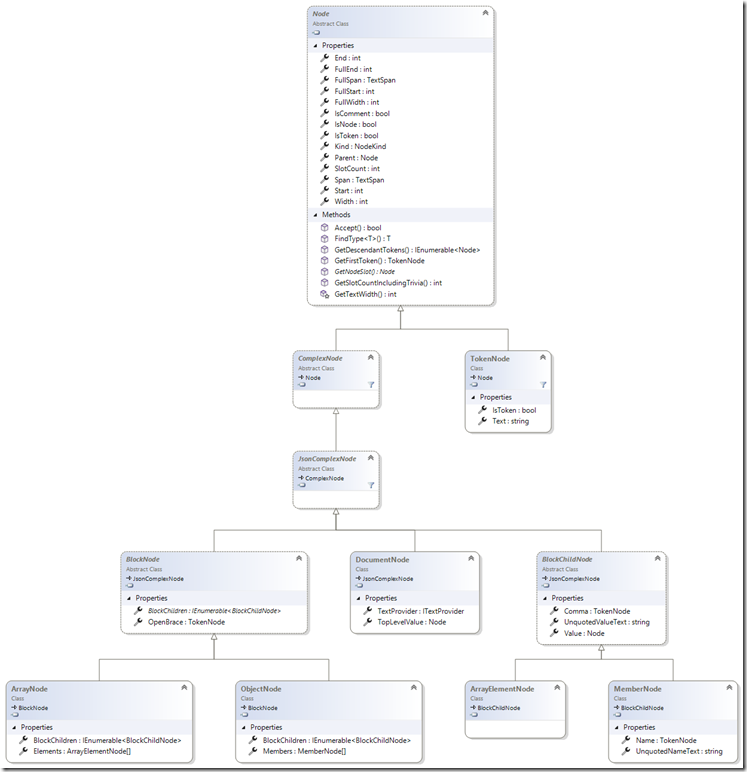
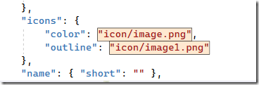

JSON on steroids #3. JSON parser

And we will move directly to working with JSON and start, perhaps, with the simplest thing – text markup and JSON parsing.

What I would like to do today:

- to finally get to JSON-specific VS mechanisms. However, we also need to talk about the most basic things – how parsing works (and some related questions)

- well, as a practice: to put it all together – to make a simple extension that highlights individual properties in a JSON file

So, we've sketched out a rough outline, but before we get started, I want to tell you a few words about the JSON we'll be experimenting with.

## Microsoft Teams manifest

This is the extension manifest format for MS Teams. A description of the schema of this manifest can be found here. For us, all the features that are in this file are not so important - we will just "automate" the work with its individual properties and nodes.

Here is a small example of a canned manifesto that will be useful to us in the future:

```json
{
    "manifestVersion": "1",
    "version": "1.0",
    "id": "",
    "packageName": "",
    "developer": {
        "name": "",
        "websiteUrl": "",
        "privacyUrl": "",
        "termsOfUseUrl": ""
    },
    "accentColor": "",
    "description": {
        "short": "",
        "full": ""
    },
    "icons": {
        "color": "",
        "outline": ""
    },
    "name": { "short": "" },
    "staticTabs": [
        {
            "contentUrl": "",
            "entityId": "",
            "name": "",
            "scopes": [ "team" ]
        }
    ]
}
```

In general, formally speaking, no one needs our editor, because MS took care of releasing a graphical [Manifest Editor](https://docs.microsoft.com/en-us/microsoftteams/platform/concepts/build-and-test/app-studio-overview#manifest-editor). But, once again, our task is not to make the editor everyone wants, but to master the basic principles of editor extensions (with an emphasis on JSON)!

## Meet JSON Parser

To begin with, it should be noted that:

- The libraries that we will discuss here and below do not have any public documentation

- Fortunately, most of the APIs of these libraries (in the part that is needed for extension scripts) are public, but (alas!) a lot of the really useful ones are hidden Sad smile

But, let's not despair, but let's figure it out.

First of all, I'll remind you what libraries we'll need (as I wrote earlier, you can find them here (<Directory_VS>\Common7\IDE\Extensions\Microsoft\Web Tools\Languages):

- **Microsoft.WebTools.Languages.Json.dll** are the main types for parsing and building a parsing tree.
- **Microsoft.WebTools.Languages.Css.dll** and **Microsoft.WebTools.Languages.Shared.dll** are the two referenced by the library above

This is what is concerned with pure parsing. However, if we want to work with the Visual Studio editor, we will need 2 more:

- **Microsoft.WebTools.Languages.Json.Editor.dll**
- **Microsoft.WebTools.Languages.Shared.Editor.dll**

Launching

Let's start with the answer to a simple question – how to start a parser. There are at least 3 ways...

- **JsonNodeParser**

The simplest is to call the **Parse()** method on the **JsonNodeParser** class, passing a parsing string as input:

```cs
var documentNode = JsonNodeParser.Parse(text);
```

The method is good for its simplicity, but since everyone directly causes parsing here, its results are not shared between different consumers. And if for small fragments this can be neglected, then for large files lags in the editor will become very noticeable!

JsonTree

The second option does not solve the problem mentioned above, but still adds some flexibility. The fact is that all parsers from Web Tools rely on a special abstraction when working with text – the ITextProvider interface:


```cs
public interface ITextProvider
{
    char this[int position] { get; }
 
    int Length { get; }
    int Version { get; }
 
    bool CompareTo(int position, string otherText, bool ignoreCase);
    bool CompareTo(int position, string otherText, int otherPosition, int length, bool ignoreCase);
    bool CompareTo(int position, ITextProvider otherProvider, int otherPosition, int length, bool ignoreCase);
    (int adjustedPosition, int adjustedLength) GetAdjustedRange(int position, int length, ITextProvider other);
    void GetLineAndColumnFromPosition(int pos, out int line, out int column);
    int GetPositionFromLineAndColumn(int line, int column);
    string GetText(int start, int length);
    int IndexOf(string text, int position, int length, bool ignoreCase);
}
```

which has several implementations (it is clear from the name that in each case it is the source of the text):

- **StringTextProvider**

- **SnapshotTextProvider**

True, only the first one Sad smile is publicly available – in the second case, both the constructor and the static creation method are not publicly available (it is clear that this can be bypassed, but still, it's a pity).

In any case, to work through ITextProvider (parsing itself), you can use the Create() method on **JsonTree**:

**JsonEditorDocument**

And, finally, the most suitable for us is to get the JsonEditorDocument object based on the familiar ITextBuffer (done by calling the static method on the JsonEditorDocument itself)


```cs
var jsonDocument = JsonEditorDocument.FromTextBuffer(textBuffer);
```

A logical question is why there is such a variety and where to apply each of the methods? Well, everything is clear with the last one – we use it as the main one when working with VS editors. And the first 2 will come in handy:

you want to use this parser, but not in an editor window (such as your dialog box)
for Unit tests (assuming, of course, that you are testing the parsing part, if you need other parts of the VS framework, you will still have to use integration tests.
Parsing works
So, the first step is to call the parser. Now let's figure out what we got as a result, especially since in all three cases the result returns slightly differently.

**JsonNodeParser**

This returns a **DocumentNode** object, which basically just wraps the parsed result (the **TopLevelValue** property will be discussed in a moment).

```cs
public class DocumentNode : JsonComplexNode
{
    public ITextProvider TextProvider { get; }
    public Node TopLevelValue { get; }
}
```

**JsonTree**

In this case, we return a **JsonTree** object that simply references the **DocumentNode**

```cs
public class JsonTree
{
    public DocumentNode Document { get; }
 
    public static JsonTree Create(ITextProvider textProvider);
}
```

**JsonEditorDocument**

And the last one is the **JsonEditorDocument**, which I think many people have figured out also references the **DocumentNode**:

```cs
public sealed class JsonEditorDocument : IDisposable
{
    public DocumentNode? DocumentNode { get; }
 
    public event EventHandler<NodesChangedEventArgs>? NodesChanged;
    public event EventHandler<TreeUpdatedEventArgs>? TreeUpdated;
    public event EventHandler<EventArgs>? Closing;
 
    public static JsonEditorDocument FromTextBuffer(ITextBuffer textBuffer);
    public void Dispose();
}
```

In general, compared to the previous 2nd, this option looks much richer. The presence of events like NodesChanged and TreeUpdated suggests that the basic use case looks like this:

- create a single instance of JsonEditorDocument (we don't have to store it somewhere – just get it through the same static FromTextBuffer method)

- subscribe to parsing result change events and, for example, cause a change in the tagging results (by generating the TagsChanged event)
Unfortunately, everything is not so simple and not so beautiful there, but we will talk about this a little later...

Parsing Result Tree

So, we've figured out that, in principle, any option we choose to get parsing results comes down to a single case – getting a DocumentNode object – so it's time to talk about how this result is presented and what we can work with it.

The hierarchy of classes representing the result of JSON parsing is visible in this diagram (all classes except Node have hidden methods, because they are only overrides of the base class methods – there are no new ones of their own):



To make it easier to deal with it, let's briefly run through the main points:

- base class, from which all others are inherited. Its properties and methods can be divided into 2 groups:

  - those that describe the parsed text fragment (Start, End, Width, ...)

  - those that operate at the syntactic unit level (IsToken, IsNode, **GetDescendantTokens**(), ...)

- all atomic elements are represented by the **TokenNode** class. These include:

  - auxiliary elements of markup: brackets (square and curly), commas, colons

  - Field Names

  - Field values, represented by simple types such as strings, numbers, and Boolean values

- complex (composite) elements are descendants of **ComplexNode** (more precisely, from **JsonComplexNode**)

  - Arrays are represented by a pair of classes:

    - **ArrayNode** – the array itself

      - **Elements** property – Array elements

    - **ArrayElementNode** – Array element (including comma)

      - The Value property is the value of the element. It can be either simple (then represented by the TokenNode class) or complex (ComplexNode)

    - The property returns a value as a text string

  - Objects (or associative arrays, i.e. key-value structures) are represented by a similar pair
    
    - **ObjectNode** (object fields are accessible through the Members properties)
    - **MemberNode**

- well, the entire parsed document (as mentioned earlier) is the **DocumentNode** class, which contains the **TopLevelValue** property of the **Node** type (and this is understandable, since the valid content of a JSON document can be both the simplest type: string, number, ... – and composite: array or object)

### Traversal of a tree (fragment of a tree) parsed

The next step is to process the tree (or a fragment of it, depending on what we need) that the parser returned.

There are no discoveries here, and there are two main methods, and they are standard:

- "manual" traversal of the tree
- using the Visitor pattern

**"Manual" bypass**

If you don't need a full crawl or a search of the entire tree, but you just need to process the current node (it doesn't matter where we got it from) and its sons, then the easiest way to do this is explicitly:

- bring (if this has not already been done) to the desired node type
- get (if necessary and if it is a child of BlockNode) child nodes
- if it is a TokenNode, find out its type
- …

For example, if we know for sure that the root element is exactly an object, and we only need to collect information about its immediate fields (i.e. not go down the tree), then the corresponding code will look something like this:

```cs
var rootObject = documentNode.TopLevelValue as ObjectNode;
 
foreach (var member in rootObject.Members)
{
    switch (member.Value)
    {
        case ObjectNode obj:
            output.WriteLine($"{member.Name} = object{{{obj.Members.Length}}}");
            break;
        case ArrayNode array:
            output.WriteLine($"{member.Name} = array[{array.Elements.Length}]");
            break;
        default:
            output.WriteLine($"{member.Name} = value({member.Value})");
            break;
    }
}
```

To move up the tree, you can use:

- Parent property—Returns the parent node

- FindType<T>() method – searches up the tree, starting with the current one, for a node of type T

Note that both the property and the method can return null.

```cs
if (bbb3Node == null)
    return;
var parentObject = bbb3Node.FindType<ObjectNode>();
var parentArray = bbb3Node.FindType<ArrayNode>();
```

### Crawling with INodeVisitor/NodeVisitor

This option, on the contrary, is good when you need to go through part of the tree (or all) in depth.

Here, too, everything is more or less standard:

- For the crawl, an implementation of the **INodeVisitor** interface is made with a single **Visit(Node node)** method.

- for the node from which you want to start crawling, the Accept method is called, to which the Visitor is passed

For the simplest cases (when the visitor algorithm will not need to be reused), there is a ready-made implementation of **NodeVisitor** – to which a delegate is passed in the constructor, which will be called for each node.

```cs
MemberNode memberNode = null;
documentNode.Accept(new NodeVisitor(node =>
{
    if (node is MemberNode { Name.Text: "\"s_prop4\"" } member)
    {
        memberNode = member;
        return VisitNodeResult.Cancel;
    }
 
    return VisitNodeResult.Continue;
}));
```

### First Worker Tagger

Well, we've finally got to the first real-world JSON example!

In it, we will do a very simple thing – we will highlight the values of the color and outline fields, inside the **icons** section. Something like this:



To do this, we'll write a Tagger that will perform markup for
ITextMarkerTag, and also declare our own MarkerFormatDefinition.

For those who are not familiar with or have forgotten what ITextMarkerTag and MarkerFormatDefinition are, I refer you to the previous article

First, a description of the format (however, you won't find anything new in it):


```cs
[Export(typeof(EditorFormatDefinition))]
[Name(IconFileNameConstants.IconFileNameDefinitionName)]
[UserVisible(true)]
class IconFileNameFormatDefinition : MarkerFormatDefinition
{
 
    protected IconFileNameFormatDefinition()
    {
        this.BackgroundColor = Colors.Bisque;
        this.ForegroundColor = Colors.Black;
        this.ZOrder = 5;
 
        this.DisplayName = "_Teams Icon file name";
    }
}
```

TaggerProvider also looks frills (well, except that we pass the received **ITextBuffer** to initialize Tagger):


```cs
[Export(typeof(ITaggerProvider))]
[TagType(typeof(ITextMarkerTag))]
[ContentType(TeamsManifestContentTypeConstants.ContentTypeName)]
class IconFileNameTaggerProvider : ITaggerProvider
{
    public ITagger<T> CreateTagger<T>(ITextBuffer buffer) where T : ITag
    {
        return new IconFileNameTagger(buffer) as ITagger<T>;
    }
}
```

Well, now the main thing is Tagger himself:

```cs
class IconFileNameTagger : ITagger<ITextMarkerTag>
{
    private readonly ITextBuffer buffer;
 
    public IconFileNameTagger(ITextBuffer buffer)
    {
        this.buffer = buffer;
    }
 
    public event EventHandler<SnapshotSpanEventArgs> TagsChanged;
 
    public IEnumerable<ITagSpan<ITextMarkerTag>> GetTags(NormalizedSnapshotSpanCollection spans)
    {
        var jsonDocument = JsonEditorDocument.FromTextBuffer(buffer);
        var treeRoot = jsonDocument.DocumentNode;
 
        var result = new List<ITagSpan<ITextMarkerTag>>();
 
        treeRoot.Accept(new NodeVisitor(
            (item) =>
            {
                if (item is MemberNode property)
                {
                    var propertyName = property.Name?.GetCanonicalizedText() ?? String.Empty;
                    var parentName = property.Parent?
                        .FindType<MemberNode>()?.Name?.GetCanonicalizedText() ?? String.Empty;
                    var propertyValue = property.Value;
 
                    if ((propertyName == "color" || propertyName == "outline") 
                        && parentName == "icons"
                        && propertyValue != null)
                    {
                        var markerSpan = new SnapshotSpan(
                            buffer.CurrentSnapshot, propertyValue.Start, propertyValue.Span.Length);
 
                        var tagSpan = new TagSpan<ITextMarkerTag>(
                            markerSpan, new TextMarkerTag(IconFileNameConstants.IconFileNameDefinitionName));
 
                        result.Add(tagSpan);
                        return VisitNodeResult.SkipChildren;
                    }
                }
 
                return VisitNodeResult.Continue;
            }));
 
        return result;
    }
}
```

All the useful work here is done inside the visitor:

- We use only nodes of the MemeberNode type
- Among them, we choose those that:
  - are called color or outline
  - have a MemberNode named icons among their ancestors
  - have at least some significance
- If a suitable element is found, then for the token that represents the value of the field, we form a token tag and look no further down the tree for anything

Note that we use the GetCanonicalizedText() method to get the names, which brings different valid representations for different data into a single form. For example, true can be written both with a capital letter (True), and the property name can be either enclosed in quotation marks or not, ...

In this case, this method returns us a string without quotes always

Actually, that's all...

### To see the result

As before, the Tagger code sample can be found in https://github.com/MihailRomanov/TechTalks_JSON_on_steroids

