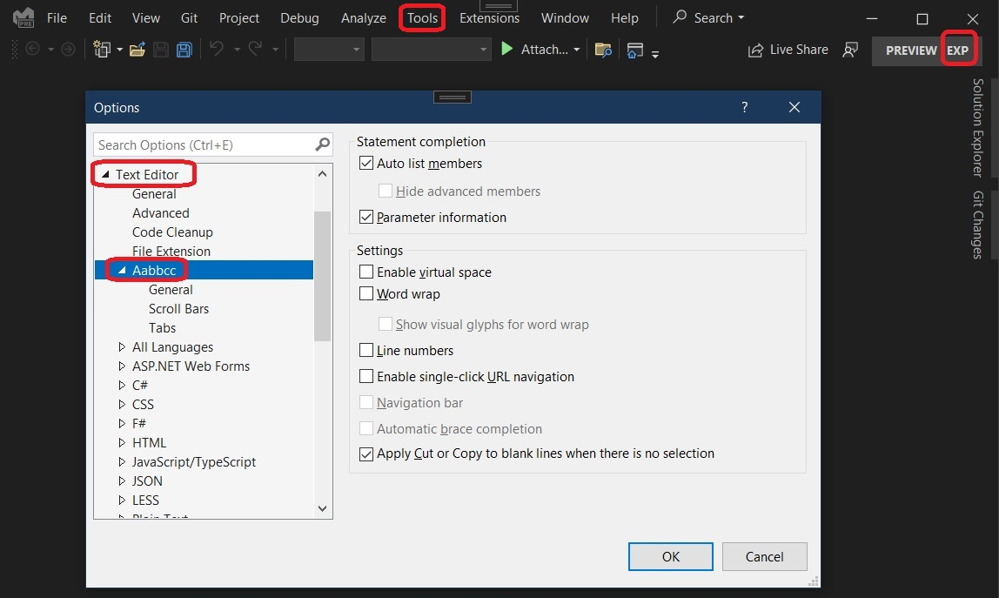

## Introduction

1. [ProvideLanguageServiceAttribute](https://learn.microsoft.com/en-us/dotnet/api/microsoft.visualstudio.shell.providelanguageserviceattribute) is introduced.

## References

1. [ProvideLanguageEditorOptionPageAttribute](https://learn.microsoft.com/en-us/dotnet/api/microsoft.visualstudio.shell.providelanguageeditoroptionpageattribute)

2. [ProvideOptionPageAttribute](https://learn.microsoft.com/en-us/dotnet/api/microsoft.visualstudio.shell.provideoptionpageattribute)

## Run
1. This is a regular VSix project. 
2. Run(F5), then Exp instance launches up.
3. Tools -> Options

4. Here we go.