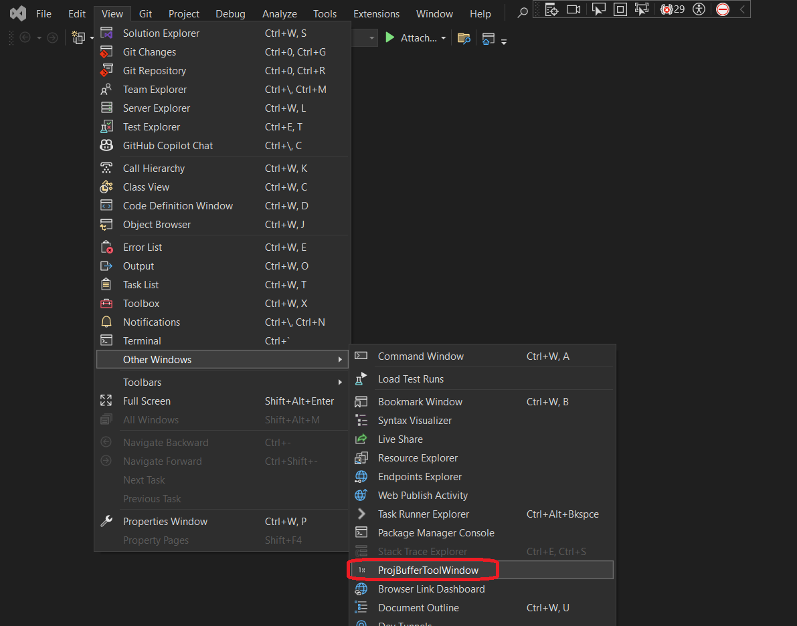
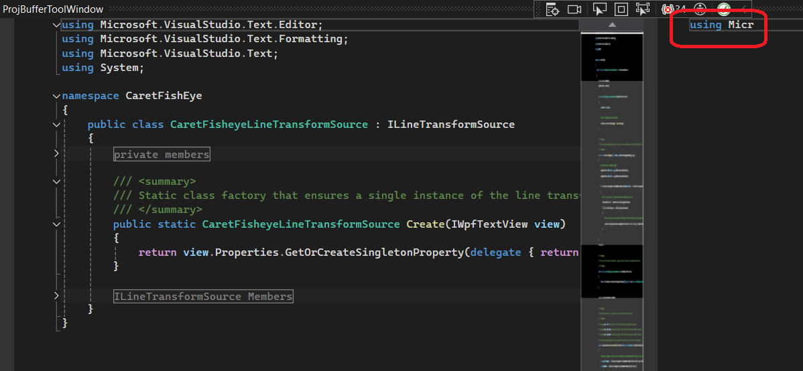

# Ripping the Visual Studio Editor Apart with Projection Buffers

## Objective
1. Introduction to Projection Buffers

## How this project is built.
1. See the article in the refernces.

## Build and Run.
1. This is currently not working. This is throwning exception.

```txt
System.Runtime.InteropServices.COMException
  HResult=0x8000FFFF
  Message=Catastrophic failure (Exception from HRESULT: 0x8000FFFF (E_UNEXPECTED))
  Source=mscorlib
  StackTrace:
   at System.Runtime.InteropServices.Marshal.ThrowExceptionForHRInternal(Int32 errorCode, IntPtr errorInfo)
```


## Update
1. Now it *IS* working. The above exception is because of the following reason.

2. The exception occurs when you do View -> Other Windows -> ProjBufferToolWindow without opening any file. You can see in the below, there is no file open but the ProjBufferToolWindow is invoked.



3. So to run correctly, open a file. Take the following steps.

4. Ensure the filePath is updated to a correct and valid file.

5. Reset Visual Studio Exp instance

 

6. ReBuild the solution. Then launch the app.
7. Next open the same file(filePath above) in the exp instance.
8. Then View -> Other Windows -> ProjBufferToolWindow.
9. Once it is opened, you can expand it to full screen.



10. On the LHS is the full view, and in the LHS is the projected view. The projected view shows only 10 chars. This is because of the following. You can see that the CreateEditor is called with end at 10. So its 10 chars.

```cs
public IWpfTextViewHost ProjectedTextViewHost
{
    get
    {
        if (_projectedTextViewHost == null)
        {
            _projectedTextViewHost = CreateEditor(filePath, start: 0, end: 10, createProjectedEditor: true);
        }
        return _projectedTextViewHost;
    }
}
```

## Whats next. Todo

1. This example has lot of things to explore.

2. First the take a look at the tool window class.

```cs
public class ProjBufferToolWindow : ToolWindowPane, IOleCommandTarget {}
```
3. The tool window class has Content property which is set to the wpf user control. But in this example, this class is much more elaborate. 

4. Further more, this class also impliments `IOleCommandTarget`. Its not yet clear, what this interface does.

5. Observe the following.

```cs
private ProjBufferToolWindowControl _myControl;
public override object Content
{
    get
    {
        if (_myControl == null)
        {
            _myControl = new ProjBufferToolWindowControl();
            _myControl.fullFile.Content = CompleteTextViewHost.HostControl; 
            _myControl.partialFile.Content = ProjectedTextViewHost.HostControl;
        }
        return _myControl;
    }
}
```

6. `ProjBufferToolWindowControl` is the xaml user control. It has two content controls `fullFile` and `partialFile`.  

7. CompleteTextViewHost and ProjectedTextViewHost of type `IWpfTextViewHost`.

8. Looking at that, we can create an extension, where this can host a fullFile view. 

9. Also need to explore `IVsRunningDocumentTable`, not clear what this is.

10. 

## References
1. https://joshvarty.com/2014/08/01/ripping-the-visual-studio-editor-apart-with-projection-buffers/

2. https://learn.microsoft.com/en-us/visualstudio/extensibility/inside-the-editor

3. https://github.com/JoshVarty/ProjectionBufferTutorial

4. https://learn.microsoft.com/en-us/visualstudio/extensibility/inside-the-editor#projection

