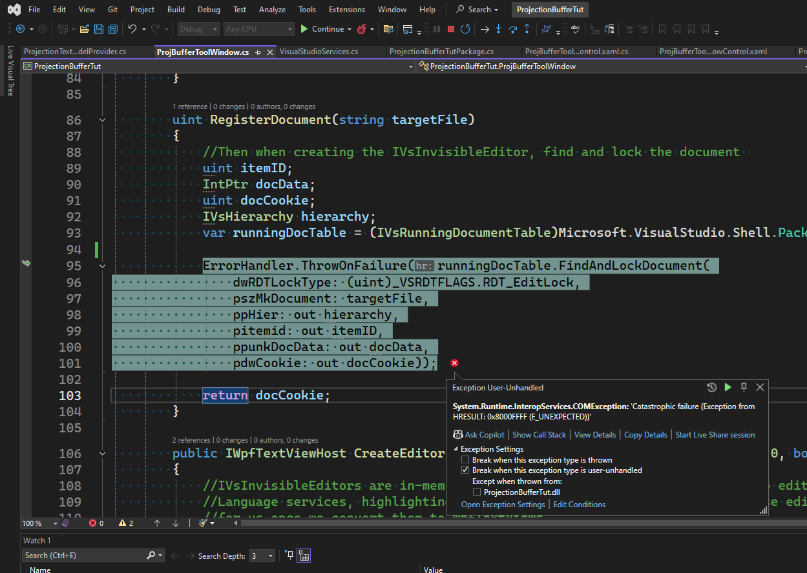

# Ripping the Visual Studio Editor Apart with Projection Buffers

## Objective
1. Introduction to Projection Buffers

## How this project is built.
1. See the article in the refernces.

## Build and Run.
1. This is currently not working. This is throwning exception.


```txt
System.Runtime.InteropServices.COMException
  HResult=0x8000FFFF
  Message=Catastrophic failure (Exception from HRESULT: 0x8000FFFF (E_UNEXPECTED))
  Source=mscorlib
  StackTrace:
   at System.Runtime.InteropServices.Marshal.ThrowExceptionForHRInternal(Int32 errorCode, IntPtr errorInfo)
```




## References
1. https://joshvarty.com/2014/08/01/ripping-the-visual-studio-editor-apart-with-projection-buffers/

2. https://learn.microsoft.com/en-us/visualstudio/extensibility/inside-the-editor

3. https://github.com/JoshVarty/ProjectionBufferTutorial

4. 
