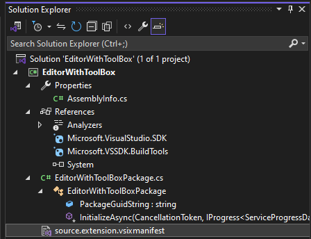
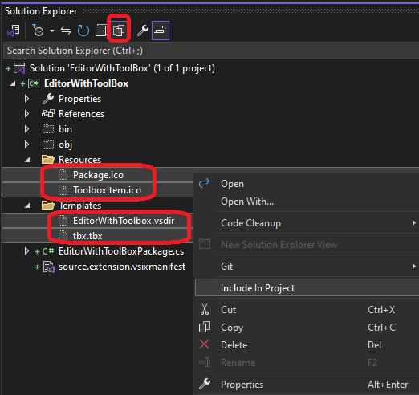
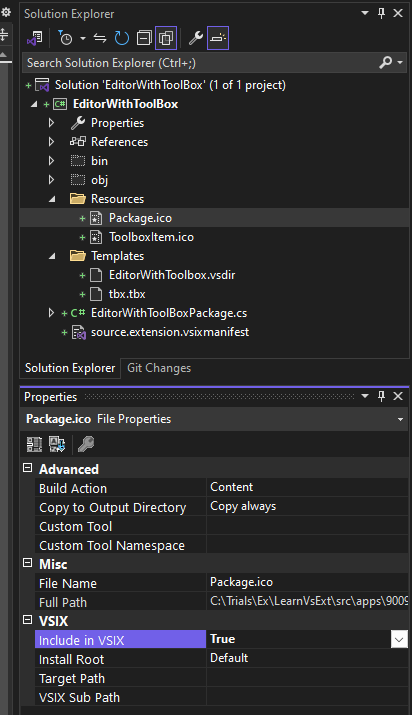
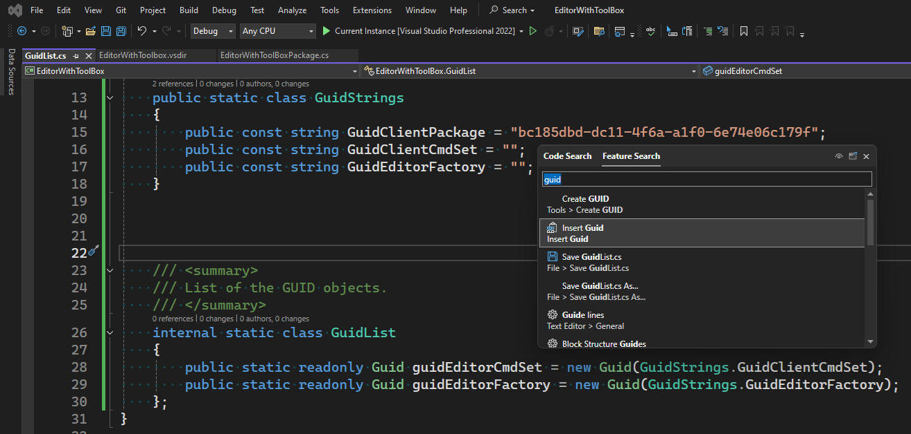
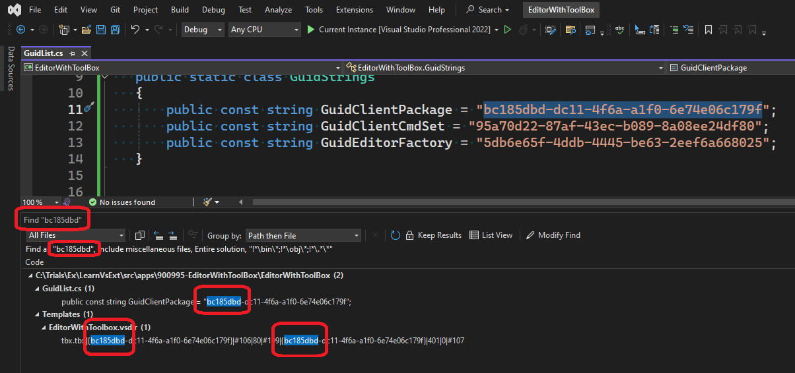
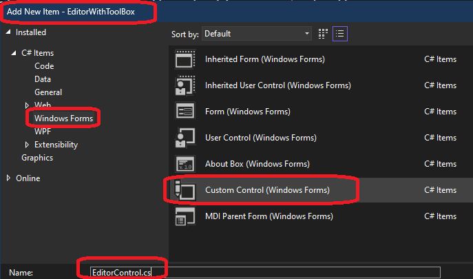
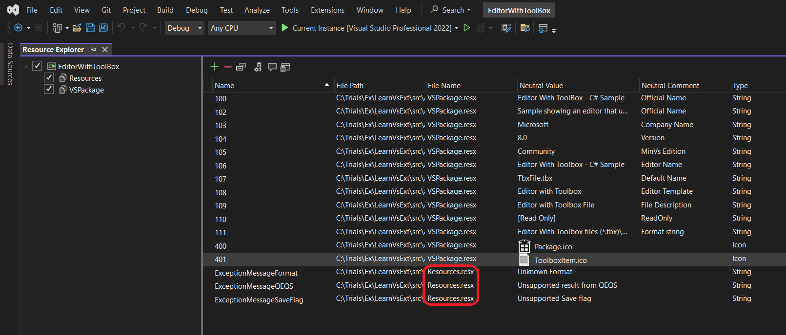
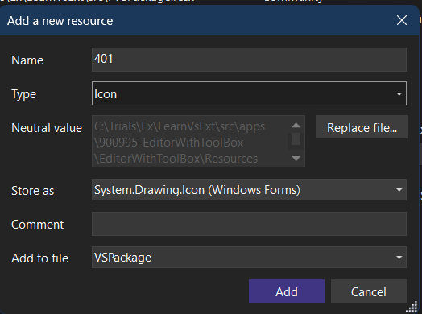
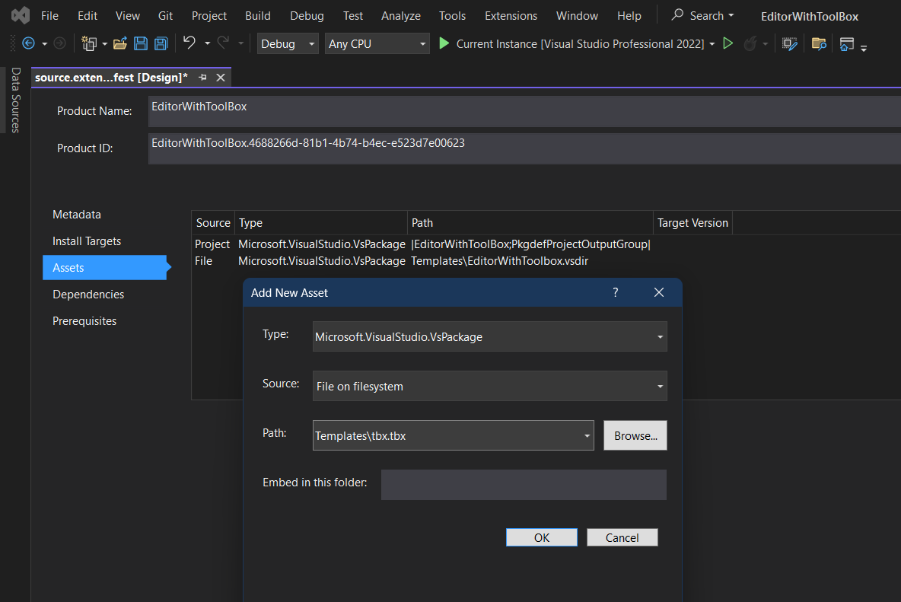

# Editor With ToolBox

## Objective
1. 

## How this project is built.
1. Start with regular VSix Project. 



2. Add two folders, Resources and Templates, with contents as shown below.



3. Right click each one of those four files and Let the properties be as below(Content, Copy always, True and Default). Its not clear, it should be same for all of the four files as below, but for now, let that be as shown below.



4. Add a GuidList file. Click Seach and in the feature seach, look for Guid and add fresh new guids as follows.



5. Ensure the guids match as follows. The GuidClientPackage must match the one in Templates\EditorWithToolbox.vsdir as follows.



6. Add a windows forms custom control, as follows.



7. Remove the backend designer file, and also remove the partial keyword. Let the class be derived from RichTextBox as follows. 

```cs
using System.Windows.Forms;

namespace EditorWithToolBox
{
    public class EditorControl : RichTextBox
    {
        public EditorControl()
        {
            InitializeComponent();
        }
        private void InitializeComponent()
        {
            WordWrap = false;
        }
    }
}
```

8. Add a serializable class called ToolboxItemData file. 

10. Add two resource files, Resources.resx and VsPackage.resx files.



11. Adding ico file.



12. Add an EditorFactory Class.

13. Add and EditorPane class.

14. Ensure VSixManifest file has the following assets.




## Build and Run.
1. This is currently not working. This is throwning exception.


```txt
System.Runtime.InteropServices.COMException
  HResult=0x8000FFFF
  Message=Catastrophic failure (Exception from HRESULT: 0x8000FFFF (E_UNEXPECTED))
  Source=mscorlib
  StackTrace:
   at System.Runtime.InteropServices.Marshal.ThrowExceptionForHRInternal(Int32 errorCode, IntPtr errorInfo)
```


## References
1. https://joshvarty.com/2014/08/01/ripping-the-visual-studio-editor-apart-with-projection-buffers/

2. https://learn.microsoft.com/en-us/visualstudio/extensibility/inside-the-editor

3. https://github.com/JoshVarty/ProjectionBufferTutorial

4. 
