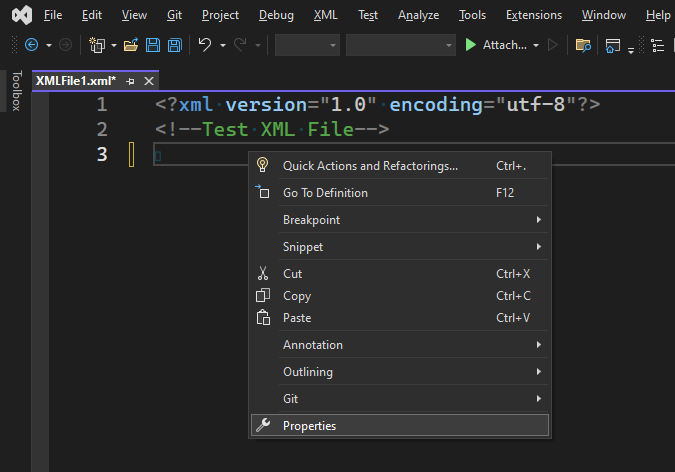
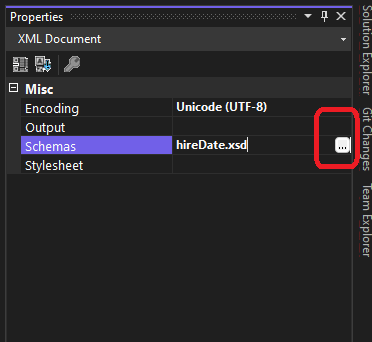

# Trails With ToolBox

## Objective
1. The steps in this walkthrough show you how to create a new XML document. The walkthrough also uses some of the features of the XML editor that make it valuable for XML authoring.

## How this project is built.
1. First save the xsd file [from this location](https://learn.microsoft.com/en-us/visualstudio/xml-tools/walkthrough-using-xml-editor-features#hiredatexsd-file) to save it as hireDate.xsd at a convenient location.

2. Start the [first step here by creating a new xml file](https://learn.microsoft.com/en-us/visualstudio/xml-tools/walkthrough-using-xml-editor-features#to-create-a-new-xml-file-and-associate-it-with-an-xml-schema) 

3. Right click the xml file area -> Properties

4. Select Schemas

5. Click Add button to add the hireDate.xsd file from where you have saved. 

6. Continue with the steps [to add data](https://learn.microsoft.com/en-us/visualstudio/xml-tools/walkthrough-using-xml-editor-features#to-add-data)

7. 

## References
1. https://learn.microsoft.com/en-us/visualstudio/xml-tools/walkthrough-using-xml-editor-features
2. 

