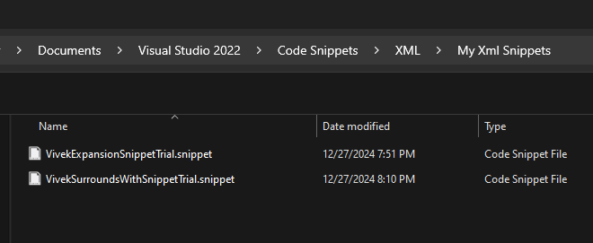
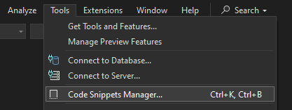
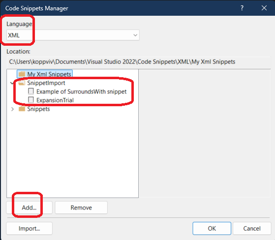

# Trails With ToolBox

## Objective
1. The XML editor has the ability to generate XML snippets from an XML Schema definition language (XSD) schema. We will explore this.

## How this project is built.
1. Follow the steps from the reference.
2. The snippet is saved on my pc at this location.
3. C:\Users\koppviv\Documents\Visual Studio 2022\Code Snippets\XML\My Xml Snippets

4. Its not necessary to save the snippets at that location only. You can save it other location and then add it in Code Snippet Manager as follows.

5. Select xml as follows.

6. 

## References
1. https://learn.microsoft.com/en-us/visualstudio/xml-tools/how-to-create-xml-snippets
2. https://stackoverflow.com/a/46465459/1977871
3. https://learn.microsoft.com/en-us/dotnet/standard/data/xml/inferring-an-xml-schema
4. https://learn.microsoft.com/en-us/dotnet/api/system.xml.schema.xmlschemainference
5. https://learn.microsoft.com/en-us/visualstudio/xml-tools/how-to-create-an-xml-schema-from-an-xml-document
6. 

