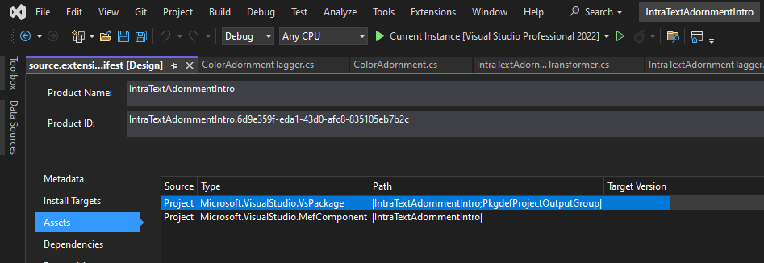
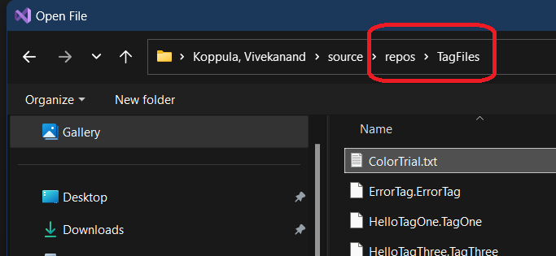
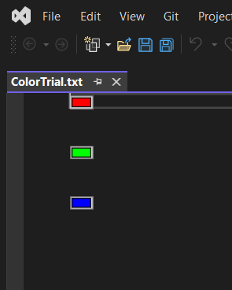
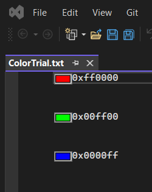

# Trails With ToolBox

## Objective
1. To understand Text Adornments.

## How this project is built.
1. https://github.com/microsoft/VSSDK-Extensibility-Samples/tree/master/Intra-text_Adornment

2. Regular VSix project and then make this a MEF component. 



3. Then add all of the classes from the VSSDK sample.

## Build and Run.

1. Reset the experimental instance, then build and Run.


2. Open ColorTrial.txt file



3. In the .\IntraTextAdornmentIntro\ColorAdornmentTagger.cs file, look for #define HIDING_TEXT at the very top.

4. Ensure #define HIDING_TEXT is NOT commented out. Reset, build and run the sample, you should see the following.



5. Ensure #define HIDING_TEXT is commented out. Reset, build and run the sample, you should see the following.




# Notes

1. In the ColorTaggerProvider class, look for the following.

```cs
// return buffer.Properties.GetOrCreateSingletonProperty(() => new ColorTagger(buffer)) as ITagger<T>;
// Instead of the above, the following also works. Not sure which is correct. 
return new ColorTagger(buffer) as ITagger<T>;
```

2. Not sure what this `buffer.Properties` is about. Asked an [SO question](https://stackoverflow.com/q/79322867/1977871). Need to wait for the answer.  

## References
1. https://github.com/microsoft/VSSDK-Extensibility-Samples/tree/master/Intra-text_Adornment

