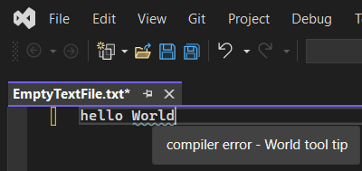

# Trails With ToolBox

## Objective
1. To understand Smart Tags. But smart tags are depricated. So in this example, smart tags are not used but instead, error tags are used. This example introduces `ITextStructureNavigatorSelectorService` and `ITextStructureNavigator`. This example also introduces `IViewTaggerProvider`

## How this project is built.

1. Start with regular VSix project, and make it a MEF component.

2. Follow the reference, but because Smart Tags, are depricated, and so this does not compile. So need to do the following changes. Instead of the following,

```cs
internal class TestSmartTag : SmartTag 
{
    public TestSmartTag(ReadOnlyCollection<SmartTagActionSet> actionSets) :
    base(SmartTagType.Factoid, actionSets) { }
}
```

derive from ErrorTag as follows. Note the ctor as well. 

```cs
internal class TestSmartTag : ErrorTag
{
    public TestSmartTag(string errorType, string toolTipContent) 
        : base(errorType, toolTipContent) { }
}
```

3. In the TestSmartTagger class, do the following changes. 

   1. In the ctor remove the subscription to LayoutChanged event. Also remove the unsubscription from dispose method. They are not needed. Infact the dispose method itself can be removed. 

    ```cs
    public TestSmartTagger(ITextBuffer buffer, ITextView view, ITextStructureNavigatorSelectorService navigatorSelectorService)
    {
        // m_view.LayoutChanged += OnLayoutChanged; // Not needed.
    }
    ```

   2. The OnLayoutChanged can be totally removed.

    ```cs
    private void OnLayoutChanged(object sender, TextViewLayoutChangedEventArgs e)
    { }
    ```

   3. The `GetSmartTagActions` method can also be removed.

    ```cs
    private ReadOnlyCollection<SmartTagActionSet> GetSmartTagActions(SnapshotSpan span)
    {
    }
    ```

   4. In the GetTags method, change the way the TestSmartTag is constructed. 
    ```cs
    //new TestSmartTag(GetSmartTagActions(extent.Span)));
    new TestSmartTag(PredefinedErrorTypeNames.CompilerError, $"{PredefinedErrorTypeNames.CompilerError} - {extent.Span.GetText()} tool tip"));
    ```

    5. Finally, the Tagger class need only the ITextStructureNavigatorSelectorService and not the tagger provider itself. So do changes accordingly.  

4. Finally remove the UpperCaseSmartTagAction and LowerCaseSmartTagAction methods.

## Build and Run.
1. Reset Vs Exp instance


2. Rebuild and Run. Once the Exp instance is launched, open an empty text file, and type a sentence with words. 

3. Observe that every new word is underlined with a squigly line showing compiler error. Also try to look at the tool tip. 



4. 

## References
1. https://learn.microsoft.com/en-us/previous-versions/visualstudio/visual-studio-2015/misc/walkthrough-displaying-smarttags

2. 

## Todo
1. https://learn.microsoft.com/en-us/visualstudio/extensibility/walkthrough-displaying-light-bulb-suggestions
2. 
